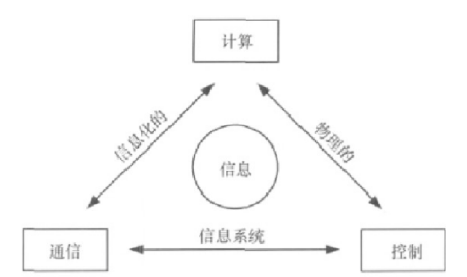
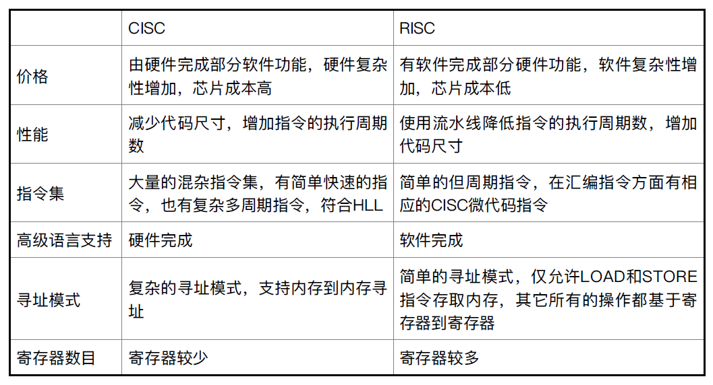
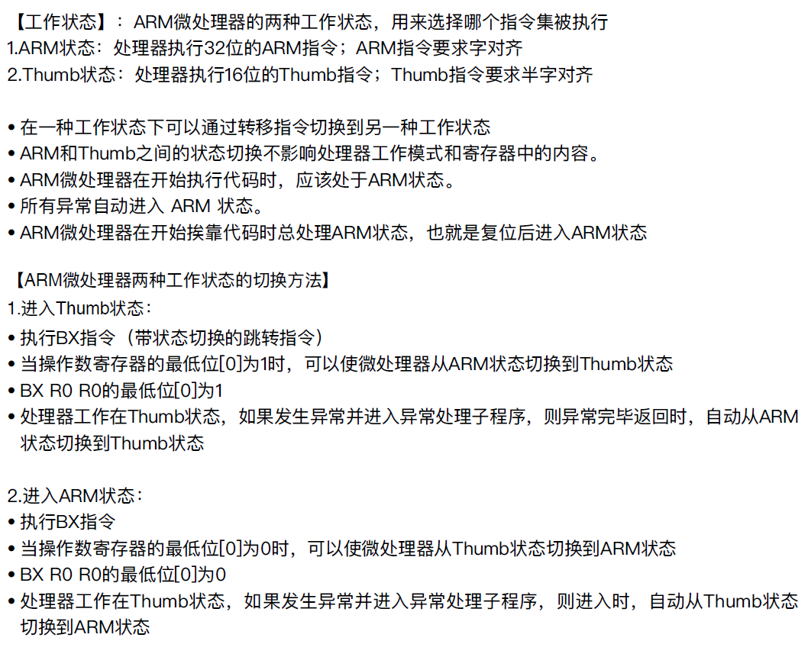
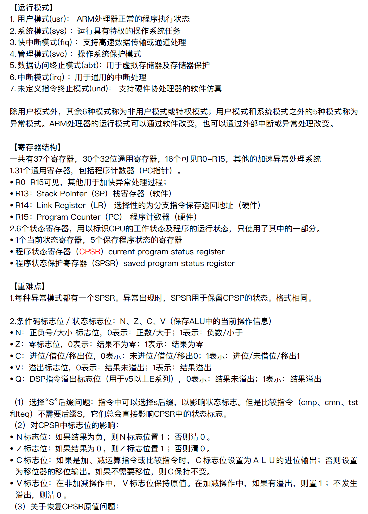
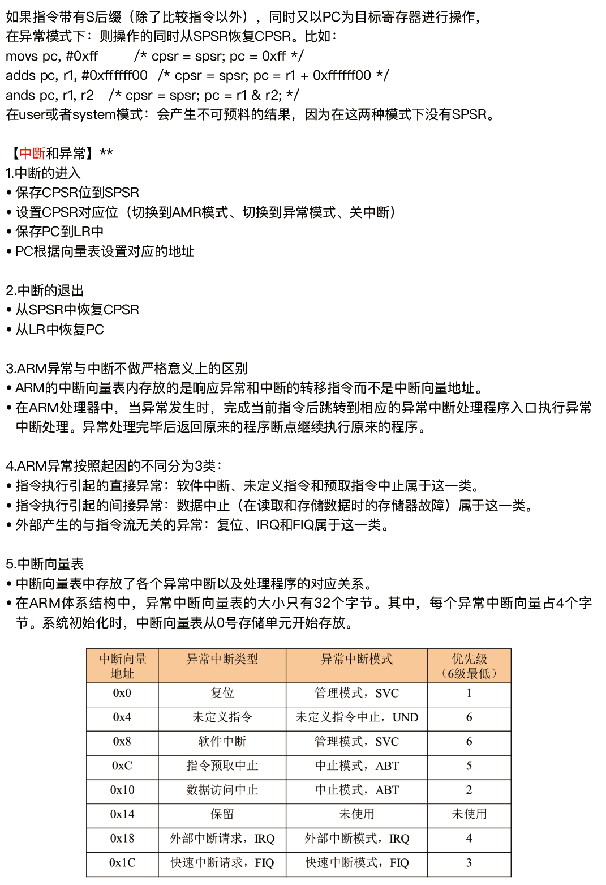
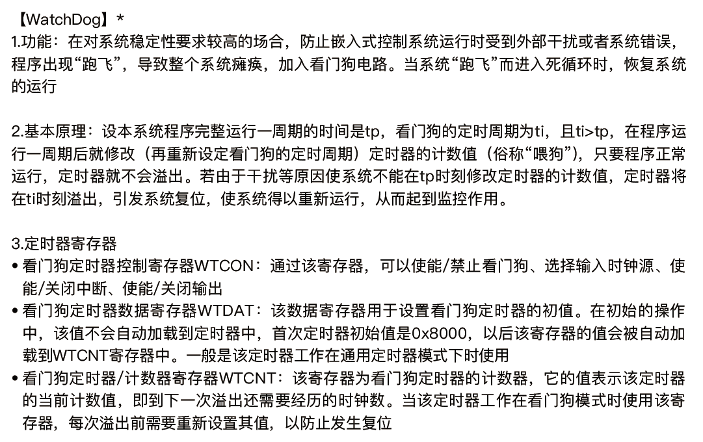
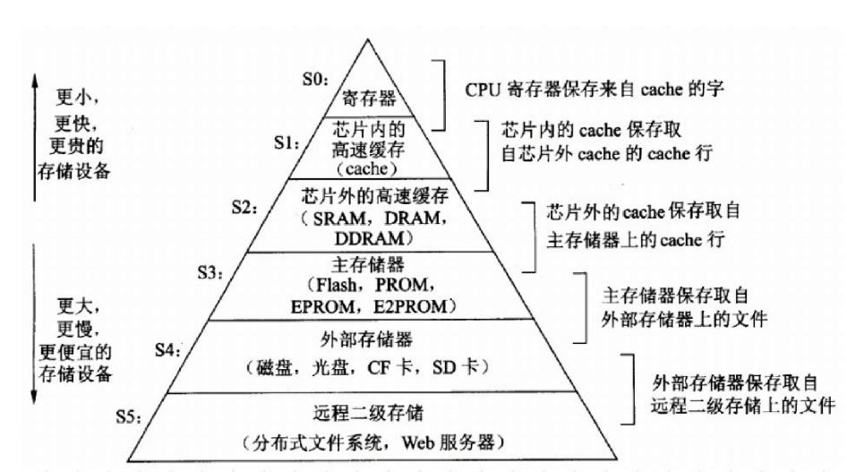
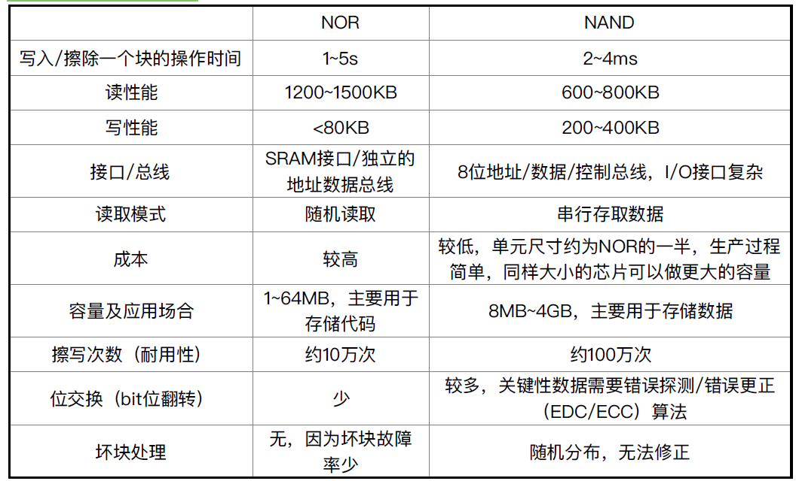

Exam2-嵌入式总结
---

# 1. 嵌入式系统的定义、特点、分类、典型应用(重要)

## 1.1. 嵌入式系统的定义

### 1.1.1. IEEE的定义
用于控制、监视或辅助操作机器和设备的装置(软件和硬件的综合体，可以涵盖机电等辅助装置)

### 1.1.2. 国内定义
以应用为中心，以计算机技术为基础，软硬件可裁剪，适用于应用系统对功能、可靠性、成本、体积、功耗有严格要求的专用计算机系统。

### 1.1.3. 嵌入式系统的三要素
> 嵌入式系统三要素：嵌入、专用、计算机
1. 嵌入式：嵌入到对象体系中，有对象环境要求
2. 专用性：软硬件按照对象要求设计、裁剪
3. 计算机：实现对象的智能化功能

## 1.2. 嵌入式系统的特点
1. 形式多样，面向特定应用
2. 得到多种类型处理器和处理器体系结构的支持
3. 极其关注成本
4. 有实时性和可靠性要求
5. 使用的操作系统适应多种处理器、可裁剪、轻量性、实时可靠、可固化的嵌入式操作系统
6. 需要专用工具和特殊方法

## 1.3. 通用计算机与嵌入式系统对比

| 特征       | 通用计算机                                                                   | 嵌入式系统                                                                               |
| ---------- | ---------------------------------------------------------------------------- | ---------------------------------------------------------------------------------------- |
| 形式与类型 | 看得见的计算机、按照其体系结构、运算速度和结构规模等因素分为大中小型机和微机 | 看不见的计算机，形式多样，应用领域广泛，按应用来分                                       |
| 组成       | 通用处理器、标准总线和外设，软件和硬件相对独立                               | 面向应用的嵌入式微处理器，总线和外部接口多集成在处理器内部。软件与硬件是紧密集成在一起的 |
| 开发方式   | 开发平台和运行平台都是通用计算机                                             | 采用交叉开发方式，开发平台一般是通用计算机，运行平台是嵌入式系统                         |
| 二次开发性 | 应用程序可重新编制                                                           | 一般不能再编程                                                                           |

## 1.4. 嵌入式系统的分类
1. 按处理器位数：4位、8位、16位、32位(主流)、64位
2. 按应用：信息家电、汽车电子、通信、移动终端、工业控制
3. 按速度：强实时系统(ms、us)，一般实时系统(s)，弱实时系统(s+)
4. 按缺额定性：硬实时系统(严格要求响应事件、否则或崩溃或错误)、软实时系统
5. 按复杂程度：循环轮询系统、有限状态机系统、前后台系统、单处理器多任务系统、多处理器多任务系统

## 1.5. 嵌入式系统的典型应用
1. 工控设备
2. 军用电子设备
3. 航天航空
4. 汽车电子
5. 信息家电
6. 通信
7. 智能玩具
8. 可穿戴设备

# 2. 嵌入式系统、IOT、CPS的基本组成(重要)

## 2.1. 嵌入式系统的基本组成
1. 组成:嵌入式硬件和软件
2. 硬件:微处理器为核心集成存储器和系统专用的输入输出设备
3. 软件:初始化代码及驱动、嵌入式操作系统和应用程序有机结合,形成系统特定的一体化软件

## 2.2. IOT
1. 定义：物联网就是万物互联的互联网，是互联网与嵌入式系统发展到高级阶段的融合。
2. 应用：智能家居制造业、环境监测
3. 组成：传感器、控制器、终端、无线模组、通信网络、应用开发平台

## 2.3. CPS的基本组成
1. CPS是一种用计算机算法控制或监视，将网络和其用户紧密结合的机制，融合各类技术、高度协同和自制，实现系统自主、只能、动态监视并改变物理世界
2. 基本组成：传感器、执行器、决策控制单元、信息中心，是嵌入式系统 + 网络(作为计算进程和物理进程的统一体，是集成计算、通信、控制与一体的下一代智能系统) + 控制功能的组合体。

# 3. 嵌入式系统设计

## 3.1. 嵌入式系统面临挑战
1. 需要多少硬件
2. 如何满足时限要求
3. 如何处理多项功能在时间上的协调性
4. 如何降低功耗
5. 如何保证系统可靠的工作
6. 如何保证系统可升级

## 3.2. 传统开发过程
1. 特征:一开始就被划分为软硬件两大部分，软硬件独立开发设计，硬件优先
2. 问题:
   1. 软硬件交互收受到很大限制，凭经验划分软硬件，软硬件之间的相互性能影响很难评估;
   2. 系统集成相对滞后，NRE较大
3. 后果:设计质量差，设计修改难，研制周期不能有效保障
4. 基本流程:需求分析，规格说明，体系结构，构件设计，系统集成

## 3.3. 软硬件协同过滤(非重点)
- 增加灵活性
- 增加风险

## 3.4. 软硬件划分
1. 嵌入式系统的设计涉及硬件与软件部件，设计中必须决定什么功能由硬件实现，什么功能由软件实现
   - 软件负责操作系统功能、协议栈、应用软件框架
2. 硬件和软件具有双重性
3. 软硬件变动对系统的决策造成影响
4. 划分和选择需要考虑多种因素
5. 硬件和软件的双重性是划分决策的前提
6. 决定因素:速度、灵活性、开销
   1. 软件实现的部分:操作系统功能(任务调度、资源管理、设备驱动)，协议栈(TCP/IP) ，应用软件框架
   2. 硬件实现的部分:基本系统，物理接口，基本逻辑电路
   3. 双重性部分:算法(加密/解密，编码/解码，压缩/解压)，数学运算(浮点运算，FFT)

# 4. 嵌入式硬件系统基础

## 4.1. 嵌入式微处理器基础

### 4.1.1. 嵌入式微处理器体系结构
1. 冯诺依曼结构与哈佛结构
   1. 冯诺伊曼结构:数据和程序放在同一个存储单元，统编址，指令和数据通过同一个总线访问
   2. 哈佛结构:
      1. 程序和数据分开存放：程序和数据存储在不同的存储空间中，即程序存储器和数据存储器是两个相互独立的存储器，每个存储器独立编制、独立访问。与之相对成的是系统中设置的两条总线(程序总线和数据总线)，从而使数据的吞吐率提高了一倍(更大存储带宽和更大可预测带宽)
      2. 每个CPU独立编程，独立访问
      3. 优点：更大存储带宽、更大可预测带宽
      4. 哈佛结构不能使用自修改代码
2. CISC与RISC
   1. CISC:复杂指令集(许多地址格式，许多操作，支持多操作码)
   2. RISC:精简指令集{流水型指令，存取指令)
   3. RISC机器用来减少指令周期的一种技术，可提高处理器和总线的使用率
3. 嵌入式处理器(了解)：
   1. 嵌入式微处理单元(MPU)、微控制器(MCU)、DSP处理器、SoC
   2. 微控制器:总线、I/O、RAM、ROM等

1. 流水线技术
   1. RISC机器用来减少指令周期的一种技术，提高处理器和总线的使用率
   2. 在CPU中由若于个个不同功能的电路单元组成一条指令处理流水线， 然后将一条指令分成若干步后再由这些电路单元分别执行，这样就能实现在一个CPU时钟周期完成一 条指令， 因此提高CPU的运算速度。
   3. 优点:提高CPU利用率、并行计算
   4. 3级流水线(ARM7TDMI):双指、译码、执行
   5. 5级流水线(ARM9TDM)：取指、译码、执行、数据缓冲、写回
      1. 减少每个周期的工作=>允许更高的时钟频率
      2. 分离数据和指令存储器=>降低CPI
   6. 6级流水线(ARM1OTDM)：取指、发射、译码执行、存储器、写回
      1. 管道刷新并在分支上重新填充，导致执行速度变慢
      2. 指令集消除代码中的小跃点的特殊功能，以获得最佳的流通性拼写
2. 信息存储的字节顺序
   1. 不管是大端法还是小端法存储，计算机在内存中存放数据的顺序都是从低地址到高地址
   2. 大端法是首先取高字节的数据放在低地址;小端法是首先取低字节的数牧据放在低地址
3. 分类
4. 选型

### 4.1.2. ARM(非重点)
1. 工作状态
2. 运行模式
3. 寄存器结构
4. 中断和异常
5. WatchDog*

## 4.2. 嵌入式系统的存储体系

### 4.2.1. 存储器系统：存储器系统的层次结构
1. (CPU寄存器)寄存器组
2. (芯片内高速缓存)片内cache、 写缓存、TCM、片内SRAM(芯片外高速缓存)板卡级SRAM、 DRAM和SRAM
3. (主存储器) FLASH PROM EPROM
4. (外部存储器)硬盘驱动器和光盘驱动器
5. 嵌入式系统的存储器包括主存和外存
6. 大多数嵌入式系统的代码和数据都存储在处理器可直接访问的存储空间即主存中。
7. 系统上电后在主存中的代码直接运行。主存储器的特点是速度快，般采用ROM、 EPROM NorFash、SRAM、DRAM等存储器件。
8. 目前有些嵌入式系统除了主存外，还有外存。外存是处理器不能直接访间的存储器，用来存放各种信息，相对主存而言具有价格低、容量大的特点。
9. 在嵌入式系统中一般不采用硬盘而采用电子盘做外存，电子盘的主要种类有NandFlash. SD(Secure Digta) 卡、CompactFlash. SmartMedia、 Memory Stick、 MutMediaCard. DOC(Disk On Chip)等

### 4.2.2. ROM的种类与选型
1. ROM：固定内容、掩膜工艺、无法修改
2. PROM：一次编程ROM，一旦导入、无法改变
3. EPROM：加电可擦除，多次
4. FLASH：快闪存储器

### 4.2.3. Flash的种类与选型

### 4.2.4. RAM的种类与选型
1. SRAM：不用刷新，速度快，价格贵，容量小
2. DRAM：(内存)速度稍慢，加点更新
3. SDRAM：同步冬天处理器，提升性能(时钟)

### 4.2.5. Cache(非重点)
1. 指令cache、数据cache
2. cache命中率(替换规则Random、LRU)
3. L1、L2、L3三级Cache

## 4.3. 嵌入式系统总线(重点)

### 4.3.1. 总线结构，常见的总线及特点
> 总线结构:单、双、多
1. 单总线结构:使用一条单一的系统总线来链接CPU、主存和/设备。总线只能分时工作，使信息传送的吞吐量受到限制。
2. 双总线结构:在CPU和主存之间专门设置了-组高速的存储总线，使CPU可通过专用总线与存储器交换信息，并减轻了系统总线的负担。主存仍可通过系统总线与外设之间实现DMA操作，而不必经过CPU.
3. 多总线结构:在双总线系统的基础上增加/O总线，其中系统总线是CPU、主存和通道(IOP) 之间进行数据传送的公共通路，而/O是多个外部设备与通道之间进行数据传送的公共通路。通道实际上是一台具有特殊功腿的处理器，它分担了一部分CPU的功能，以实现对外设的统一管理及外设与主存之间的数据传送。

### 4.3.2. 输入输出编程：忙等IO和中断IO
1. 忙等I/O:用指令来检直设备是否就绪
   1. 最简单的设备驱动方式
   2. CPU不能在检查设备的过程中执行其他指令
   3. 很难处理同时发生的IO操作
2. 中断I/O:基于子程序调用，使下一条指令为一个子程序调用的预定位置，返回位置藏保存确保执行前台程序
   1. CPU和设备之间通过总线连接
   2. CPU和设备之间进行握手
   3. 设备发出中断请求
   4. 当CPU能处理中断时发出中断确认请求
3. 总结
   1. 两种机制确保中断更加有效:优先级决定哪个中断先获得CPU;中断向量决定每个中断对应的执行代码
   2. 忙等效事比较低，CPU在等待设备的时候不能做其他工作，无法同步进行输入输出
   3. 中断IO允许设备更改CPU控制流

### 4.3.3. Programming I/O：Independent I/O port. memory-mapped I/O.

### 4.3.4. GPIO接口基本原理与结构（不考）

# 5. 嵌入式系统软件知识

## 5.1. 嵌入式软件基础知识(重点)

### 5.1.1. 嵌入式软件的特点

### 5.1.2. 嵌入式软件的分类（系统软件、支撑软件、应用软件）

### 5.1.3. 嵌入式软件体系结构
考题:常见的体系结构，什么情况下采用哪种，各自的优势和缺陷

|  | 优先级| 响应事件 | 变动的影响 | 共享数据 |
| - | - | - | - | - |
| 轮询 | 无，一切按序运行 | 所有任务之和 | 非常大，增加任务或修改任务时间影响所有任务 | 无 |
| 状态机 | 当前状态决定下一个状态优先级 | 所有任务之和 | 同上 | 同上 |
| 带中断轮询 | 中断比主循环优先级高，中断有优先级 | 任务和中断执行时间和 | 主循环同轮序一样，对中断服务历程影响不大 | 必须处理和中断服务例程分享的数据 |
| 纯中断 | 中断有优先级 | 中断执行时间 | 对中断服务例程影响不大 | 同上 |
| 函数队列 | 中断有优先级，其他任务按序进行 | 最长任务执行时间 | 低，中断管理优先级函数，队列管理较低优先级 | 同上 |

> 驱动层

1. 板级初始化程序
2. 与系统软件相关的驱动
3. 与应用软件相关的驱动
4. 与应用软件相关的驱动不一定需要与操作系统连接，这些驱动的设计和开发由应用决定。

> 操作系统层

1. 操作系统层包括嵌入式内核、嵌入式TCP/P网络系统、嵌入式文件系统、嵌入式GU系统和电源管理等部分。
2. 其中嵌入式内核是基础和必备的部分，其他部分要根据嵌入式系统的需要来确定。

> 中间件层

1. 目前在一些复杂的嵌入式系统中也开始采用中间件技术，主要包括嵌入式CORBA嵌入式Java、嵌入式DCOM和面向应用领域的中间件软件。
2. 如基于嵌入式CORBA的应用于软件无线电台的应用中间件SCA(Software Core Architocturo)

> 应用层

1. 应用层软件主要由多个相对独立的应用任务组成
2. 每个应用任务完成特定的工作，如IO任务、计算的任务、通信任务等，由操作系统调度各个任务的运行。

## 5.2. 嵌入式操作系统基础知识(重点)

### 5.2.1. RTOS概念、特点、选型原则（商业化RTOS）
1. 实时操作系统(Real-Time Operating Systom, RTOS)
2. RTOS:对外来事件能在限定的响应时间内做出预定质量处理的计算机系统
3. 特点:可移植性、强调实时性能、内核精简、抢占式内核、使用可重入函数、可配置、可裁剪、高可靠性，PPT:可靠性、可预测性、确定性、高性能、紧凑、可扩展性
4. 商业化RTOS举例: uC/OS II, ThreadX, VxWorks, Linux/RT, FrooRTOS
5. 选型原则:综合权衡:成本，可靠性(工具链、功耗)，实时性，工具链，模块丰富，RTOS内核RAM、ROM占用量，支持

### 5.2.2. 任务管理
1. 进程、线程、任务的概念
   1. 进程:操作系统进行资源分配的基本单元
   2. 线程:轻量级进程，是操作系统任务调度和执行的基本单位
   3. 任务:最抽象、软件完成一个活动，可以是进程可以是线程。
2. 任务的实现（任务的层次结构、任务控制块、任务的状态及状态转换、任务队列）
   1. 任务控制块(TCB)描述一个任务的核心数据机构包括任务堆栈指针、任务状态、优先级等，任务创建的时候创建TCB表
   2. 任务转换:
      1. 保护当前的任务的现场(寄存器)，判断是否能转换
      2. 恢复新任务现场
      3. 执行中断返回指令
      4. 执行新的任务
3. 任务调度（可抢占调度、不可抢占调度、先来先服务、时间片轮转算法、优先级算法）
   1. 空暇任务:`OSTaskIdle()`任务、`OSTaskStat()`任务
   2. 任务就绪表:两个变量OSRdyGrp、OSRdytbl[8]，都是从右侧开始读。
4. 实时系统及任务调度（RMS、EDF算法）
   1. RMS:单一速率调度
      1. 静态调度策略，分配给每个进程的优先级是固定不变的。基于单一速率分析。
      2. 周期最短的进程被指定为最高优先级。每个周期开始，P进去，根据优先级调度执行，执行结束就从
      3. 就绪状态退出直到他下一个周期开始。看书P202
   2. EDF:最早截止时限优先调度
      1. 动态的优先级方案，在进程执行时根据进程的启动时间改变进程的优先级。
      2. 根据截止时限顺序指定优先级。最高优先级的进程是当前截至时限最临近的进程。
      3. 做法:看书p205 先写出all时间片内的截至时限，然后根据截至时限进行选择调度
5. 任务间通信（共享内存、消息、管道、信号）
   1. 使用邮箱和消息队列
6. 同步与互斥（竞争条件、临界区、互斥、信号量、死锁）
   1. 临界区：访问共有资源的程序片段，而这些共有资源无法同时被多个进程锁访问
   2. 解决方法：信号量PV操作(实现互斥访问、行为同步)、中断

### 5.2.3. (补充)RTOS ucos-II采取哪些机制、策略来确保任务实时性
1. 任务调度总是选择就绪任务中优先级最高的一个
2. 允许任务间抢占
3. 具有优先级的中断机制
4. 有确定性的任务调度(切换时间和中断延迟)
5. 精度高的时钟节拍产生时钟中断
6. 信号量、信箱等通信机制

### 5.2.4. (补充)原始优先级上限和立即优先级上限
1. 当一个高优先级任务通过信号量机制访问共享资源时，该信号量已被低优先级任务占有，高优先级任务被阻塞，无法保证实时性。
2. 优先级天花板(立即优先级上限，ICPP)：当任务申请资源时，把该任务的优先级提升到可访问这个资源的所有任务的最高优先级。此优先级称为这个资源的优先级天花板，此方案简单可行，不管任务是否阻塞了高优先级任务运行，只要任务访问共享资源则提升优先级。
3. 优先级集成(原始优先级上限)：当任务A申请共享资源S，如果S正在被任务C使用，通过比较任务C和自身优先级，如果C < A，则任务C的优先级提高到自身A的优先级，C释放资源S后，恢复到原始优先级，此方法只在低优先级阻塞高优先时才动态改变优先级，过程复杂时需要多次判断。

### 5.2.5. (补充)ucos-II如何从64位系统位扩展到256位
1. 修改`os_cfg.h`中`#define OS_LOWEST_PRIO 63 -> 254`
2. 新版的ucos-II可以自动根据`OS_LOWEST_PRIO`的大小判断TBL大小和算法，不需要修改，对于旧版，则`ucos_ii.h`中修改TCB表的大小(8->16)，在`os_core.c`中个修改算法
   1. 将16位修改成低8位和高8位：若低8位为0，则在高8位，反之则为低8位，找到高低之和，再进行进一步判断
   2. 总之将8组 * 8个/组->16组 * 16个每组，高八位计算按位运算模式使用Map，并在最后计算优先级时+8再算。

### 5.2.6. ucos-ii的特点
1. 可抢占多任务实时内核，是优先级最高的
2. 不支持时间片轮转法
3. 任务调度所花时间为常量

### 5.2.7. 存储管理
1. 嵌入式系统静态和动态内存管理(重点)
2. ucos_ii:
   1. 采用实模式存储管理
   2. 不划分内核空间和用户空间
   3. 资源共享，任务都是线程级任务
   4. 代码段、数据段、bss段、堆栈、多内存分区，每个分区大小相同，不通过分区大小不同。
3. freertos：固定分区的存储管理方法，put时必须放入get时去除的内存块
   1. Heap1:不支持free，简单表组分配，适用于确定性任务
   2. Heap2:简单的free，会导致碎片，应用于每次释放申请内存大小相同的任务
   3. Heap3:调用malloc和free，通过挂起调度器实现了线程安全性。

### 5.2.8. 设备管理（不考）
1. 设备无关性、I/O地址、I/O控制、中断处理

### 5.2.9. 文件系统基础知识（不考）

### 5.2.10. 操作系统移植基础知识（不考）

## 5.3. 嵌入式系统程序设计（不考）

### 5.3.1. 嵌入式软件开发基础知识

### 5.3.2. 嵌入式程序设计语言
1. 汇编、编译、解释系统的基础知识和基本工作原理
2. 汇编语言
3. 各类程序设计语言的主要特点和适用情况

### 5.3.3. 嵌入式软件开发环境
1. 交叉开发（宿主机、目标机）
   1. 嵌入式软件的交叉开发采取宿主机和目标机的模式，软件开发在宿主机(通常是PC)上，目标机用于运行软件
   2. 在采用宿主机/目标机模式开发嵌入式应用软件时:
      1. 首先利用宿主机上丰富的资源和良好的开发环境开发和仿真调试目标机上的软件
      2. 然后通过串口或者以太网络连接将交叉编译生成的目标代码传输并装载到目标机上
      3. 并在监控程序或者操作系统的支持下利用交叉调试器进行分析和调试
      4. 最后目标机在特定环境下脱离宿主机单独运行
2. 编辑器、编译器、链接器、调试器、模拟器
3. 常用嵌入式开发工具
4. 集成开发环境
5. 开发辅助工具

### 5.3.4. 嵌入式软件开发

# 6. 嵌入式实时内核（结合ucOS-II和freertos）(重要)
1. 实时任务调度
   1. 进程、线程、任务的概念
   2. 思想:近似地每时每刻总是让优先级最高的就绪任务处于运行状态。为了保证这一点，它在系统或用户任务调用系统函数及执行中断服务程序结束时总是调用调度器，来确定应该运行的任务并运行它
   3. 依据:任务就绪表，根据就绪表获得待运行任务的任务控制块指针
   4. 根据就绪表获得待运行任务的任务控制块指针:处理器的SP=任务块中保存的SP恢复待运行任务的运行环境:处理器的PC=任务堆栈中的断点地址其实调度器在进行调度时，在这个位置还要进行一下判断:究竟是待运行任务是否为当前任务，如果是，则不切换;如果不是才切换，而且还要保存被中止任务的运行环境
   5. 可抢占调度、不可抢占调度、先来先服务、时间片轮转算法、优先级算法
   6. 任务的实现(任务的层次结构、任务控制块、任务的状态及状态转换、任务队列)
2. 中断与时钟
   1. 中断:由于某种事件的发生而导致程序流程的改变。产生中断的事件称为中断源。
   2. CPU响应中断的条件:
      1. 至少有一个中断源向CPU发出中断信号;
      2. 系统允许中断，且对此中断信号未予屏蔽。
   3. 时钟节拍是一种特殊的中断; 
      1. μC/OS需要用户提供周期性信号源，用于实现时间延时和确认超时。节拍率应在10到100Hz之间，时钟节拍率越高，系统的额外负荷就越重;
      2. 时钟节拍的实际频率取决于用户应用程序的精度。时钟节拍源可以是专门]的硬件定时器，或是来自50/60Hz交流电源的信号。
   4. 响应中断的过程:系统接收到中断请求后，这时如果CPU处于中断允许状态(即中断是开放的)，系统就会中止正在运行的当前任务，而按照中断向量的指向转而去运行中断服务子程序;当中断服务子程序的运行结束后，系统将会根据情况返回到被中止的任务继续运行或者转向运行另一个具有更高优先级别的就绪任务
      1. 保存全部寄存器的值
      2. 将全局变量嵌套层次+1
      3. 执行中断服务
      4. 调用OSInitExit()
      5. 恢复寄存器的值
      6. 执行中断返回指令
3. 同步与通信：任务间通信的管理核心:事件控制块ECB
   1. 任务间通信:使用邮箱、消息队列实现
   2. 同步与互斥:同步可以通过开关中断实现，互斥使用信号量。
4. 存储管理 (静态、 动态) (结合ucOSII)
   1. 都是从右向左排的。记住优先级标号从0开始。ucos-1I不划分内核和用户空间，系统只有一个地址空间。管理:多个内存分区，每个分区的块大小相同，不同分区的块大小不同，为了解决碎片问题。
   2. 实时操作系统UCOS-1I如何从64个任务拓展到支持256任务?在OS_CFG.H中#defne OS_LOWEST_PRIO 63改成#define OS_LOWEST_PRIO_254
   3. 由于新版的ucos已经支持自动根据OS_LOWEST_PRIO判断TBL的大小和算法了，所以不用修改对于旧版本:需要在ucos_ji.h里修改TBL的大小(8改成16) ，然后在os_ core.c里修改算法
   4. 将16位分为低八位和高八位，如果低八位为0，则在高八位，反之，在低八位。找到高低之后，再用之前的方式寻找。总之，由8组*-组8个变成16组*- -组16个.低八位照常进行，如果在高八位，则提取出高八位按照低八位运运算模式利用map,并在最后计算优先级的时候+8再算

# 7. bsp, bootloader

## 7.1. 嵌入式系统的启动过程
1. 上电复位、板级初始化
   1. 嵌入式系统上电复位后完成板级初始化工作。
   2. 板级初始化程序具有完全的硬件特性，-般采用汇编语言实现。不同的嵌入式系统，板级初始化时要完成的工作具有一定的特殊性，但以下工作一般是必须完成的:
   3. CPU中堆栈指针寄存器的初始化。
   4. BSS段(Block Storage Space表示未被初始化的数据)的初始化。
   5. CPU芯片级的初始化:中断控制器、内存等的初始化。
2. 系统引导/升级
   1. 根据需要分别进入系统软件引导阶段或系统升级阶段。
   2. 软件可通过测试通信端口数据或判断特定开关的方式分别进入不同阶段。
   3. 直接在NOR Flash上运行
   4. 软件直接从外存读取加载如RAM，成本更低
3. 系统引导:
   1. 将系统软件从NOR Flash中读取出来加载到RAM中运行:这种方式可以解决成本及Flash速度比RAM慢的问题。软件可压缩存储在Flash中。
   2. 不需将软件引导到RAM中而是让其直接在NorFlash上运行，进入系统初始化阶段。
   3. 将软件从外存(如NandFlash、 CF卡、MMC等)中读取出来加载到RAM中运行:这种方式的成本更低。
4. 系统升级:
   1. 进入系统升级阶段后系统可通过网络进行远程升级或通过串口进行本地升级。
   2. 远程升级一般支持TFTP、FTP、HTTP等方式。
   3. 本地升级可通过Console口使用超级终端或特定的升级软件进行。
5. 系统初始化
   1. 在该阶段进行操作系统等系统软件各功能部分必需的初始化工作，如根据系统配置初始化数据空间、初始化系统所需的接口和外设等。
   2. 系统初始化阶段需要按特定顺序进行，如**首先完成内核的初始化，然后完成网络、文件系统等的初始化，最后完成中间件等的初始化工作**。
6. 应用初始化:在该阶段进行应用任务的创建，**信号量、消息队列**的创建和与应用相关的其它初始化工作。
7. 多任务应用运行:各种初始化工作完成后，系统进入多任务状态，操作系统按照已确定的算法进.行任务的调度，各应用任务分别完成特定的功能;

## 7.2. bsp、特点与bios区别
1. bsp概念:全称“板级支持包"(Board Support Packages)，一段启动代码
2. 特点:
   1. 硬件相关性:因为嵌入式实时系统的硬件环境具有相关性，所以，作为高层软件与硬件之间的接口，BSP必须为操作系统提供操作和控制具体硬件的方法。
   2. 操作系统相关性:不同的操作系统具有各自的软件层次结构，因此，不同的操作系统具有特定的硬件接口形式.
3. 功能:
   1. 单板硬件初始化，主要是CPU的初始化，为整个软件系统提供底层硬件支持
   2. 为操作系统提供设备驱动程序和系统中断服务程序
   3. 定制操作系统的功能，为软件系统提供一个实时 多任务的运行环境
   4. 初始化操作系统，为操作系统的正常运行做好准备
4. 与bios、EFI区别:
   1. BIOS: BIOS主要是负责在电脑开启时检测、初始化系统设备(设置栈指针，中断分配，内存初始化)、装入操作系统并调度操作系统向硬件发出的指令。
   2. BSP是和操作系统绑在一起运行在主板上的，尽管BSP的开始部分和BIOS所做的工作类似，可是大部分和BIOS不同，作用也完全不同。程序员还可以编程修改BSP，在BSP中任意添加一些和系统无关的驱动或程序，甚至可以把上层开发的统统放到BSP中。而BIOS程序 是用户不能更改，编译编程的，只能对参数进行修改设置。更不会包含- -些基本的硬件驱动。
   3. EFI:由于EFl框架比BIOS要大得多，其启动过程也比BIOS要复杂。于BIOS最大的区别就是EFI首先需要EBC虚拟机，然后再启动设备驱动和EFI应用程序，最后通过EFI boot manager加载操作系统引导程序。

## 7.3. 引导模式
1. 概念:将操作系统装入内存并开始执行的过程。
2. 按时间效率和空间效率不同的要求，分为两种模式:
   1. 需要Boot Loader的引导模式:节省空间，牺牲时间，适用于硬件成本低，运行速度快，但启动速度相对慢
   2. 不需要Boot Loader的引导模式:时间效率高，系统快速启动，直接在NOR flash或ROM系列非易失性存储介质中运行，但不满足运行速度的要求。

## 7.4. bootloader及其启动过程
1. bootloader:嵌入式系统中的OS启动加载程序
2. 作用:将操作系统内核从外部存储设备拷贝到内存中，并跳转到内核的首条指令
3. 启动过程:
   1. 初始化硬件，如设置UART (至少设置-个)，检测存储器等
   2. 设置启动参数，告诉内核硬件的信息，如用哪个启动界面，波特率.
   3. 跳转到操作系统的首地址
   4. 消亡

# 8. 建模(重要)
1. 建模：是为了理解系统对系统做出抽象、建立模型的过程。
2. 建模技术示例
   1. 面向状态模型：FSM
   2. 面向活动模型：数据流图、过程模型
   3. 面向结构模型：系统框图
   4. 面向数据模型：ER图
3. 有限状态机：表示有限个状态和在这些状态之间的转移和动作等行为的数学模型
4. 有限状态机分类
   1. 状态模型：单线程，只有一个状态可以在任何时候生效
      1. Moore State Methods：输出信号仅与当前状态相关：输出是当前状态的函数
      2. Mealy State Methods：不仅与当前状态相关，还和所有的输入信号有关，输出看做当前状态和而所有输入的函数。
   2. 分层FSM支持并发和层次结构：硬件设计与mealy相同问题，与软件不相关，导致更紧凑的代码
5. 示例：自动贩卖机、定时炸弹、电梯等。

# 9. 题型
1. 简答题
2. 问答题
3. 设计题：自行查阅关于扫地机器人资料

- 孙泽嵩 16页
- 曹家伟 12页