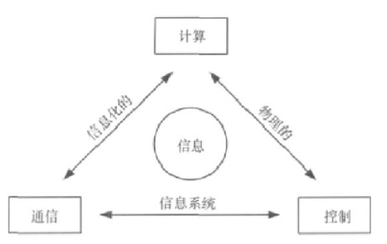
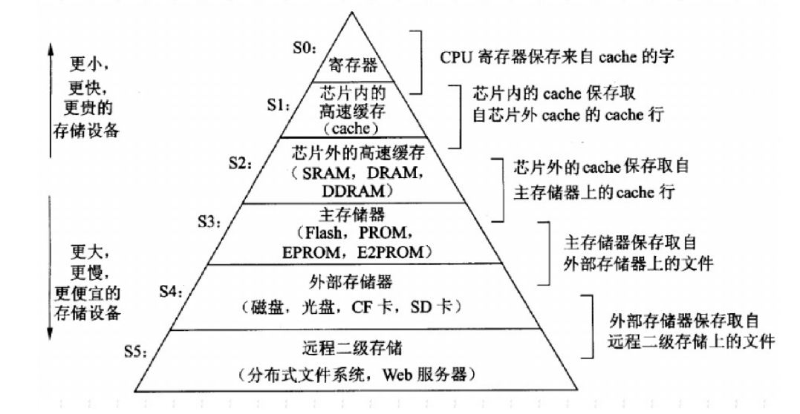
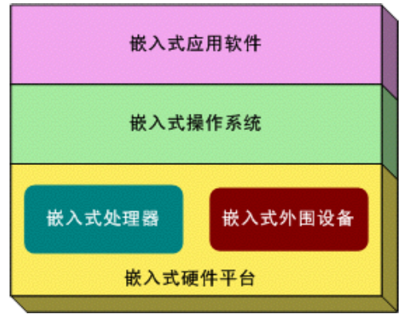
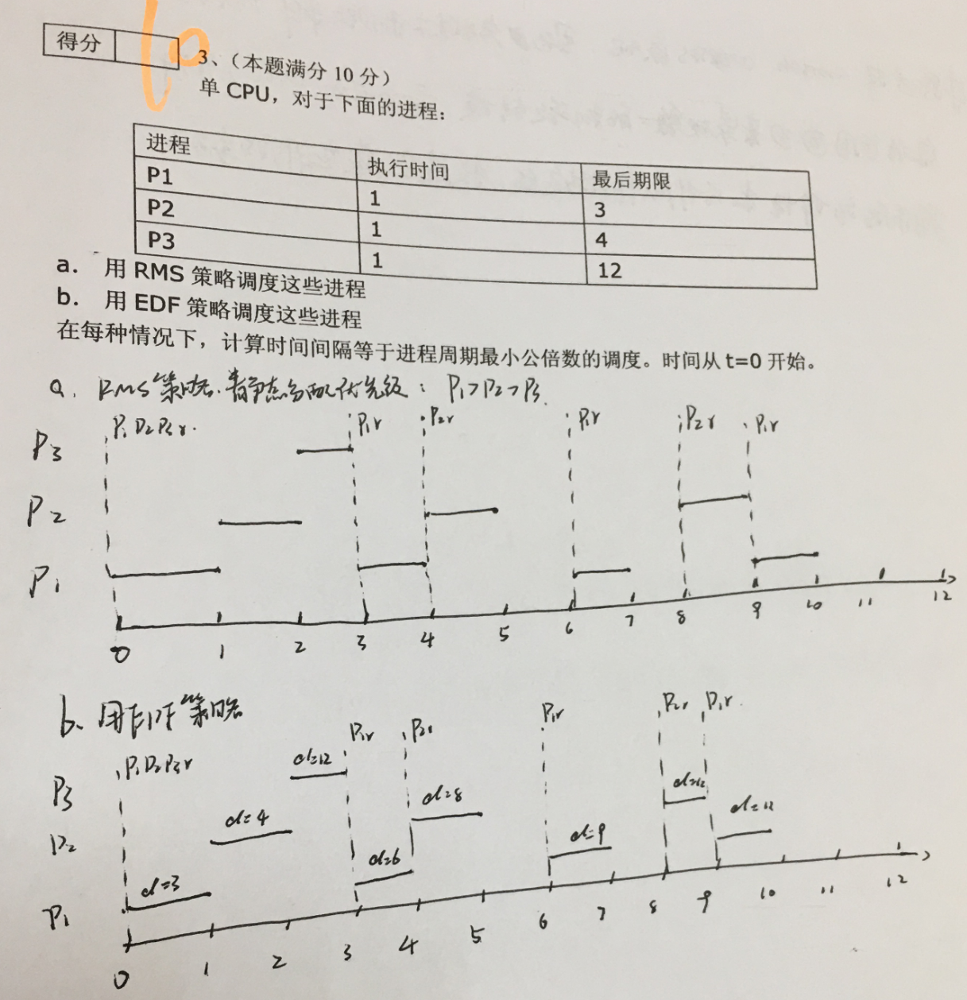
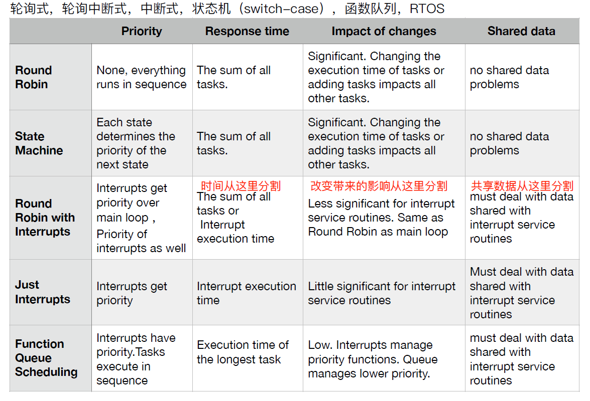
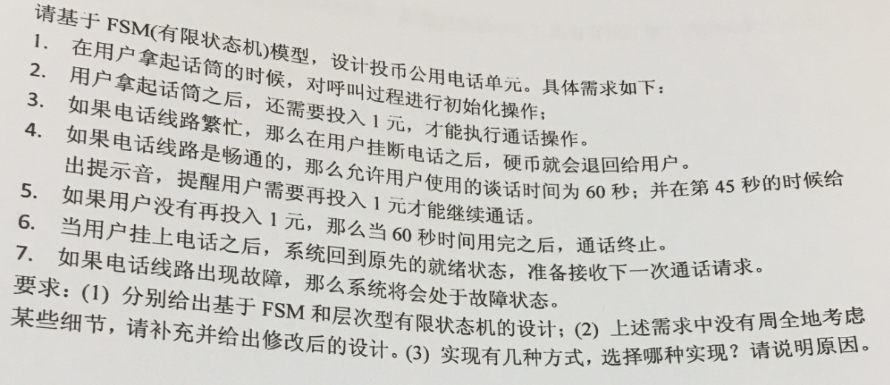
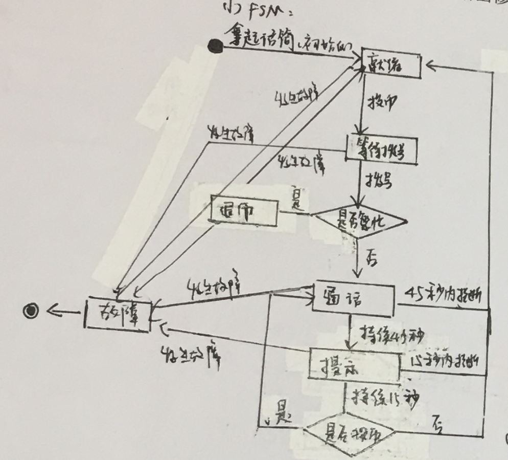
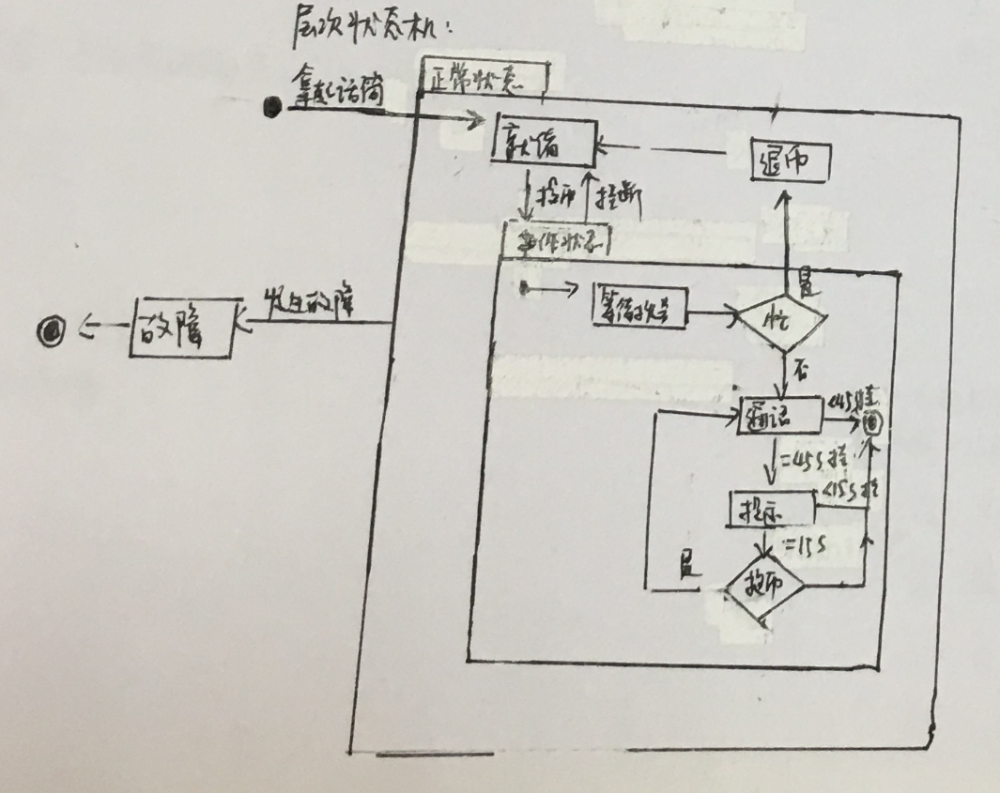
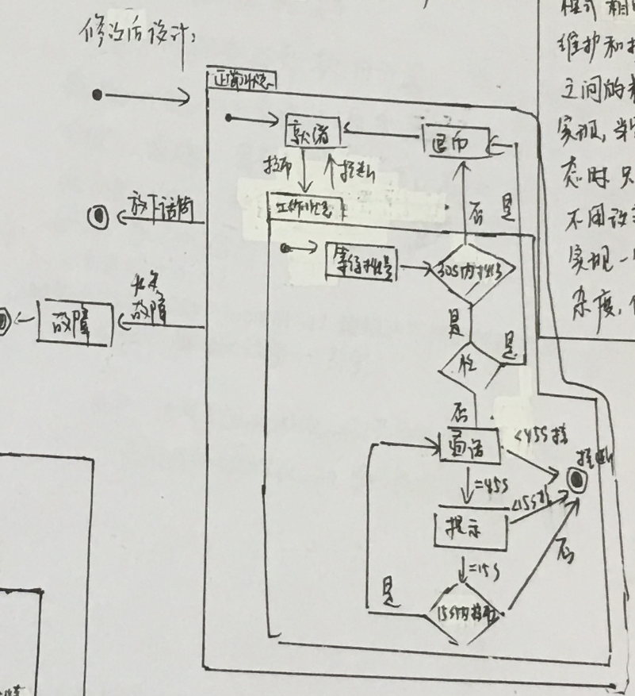

Exam3-嵌入式试卷
---

<!-- TOC -->

- [1. 简答题](#1-简答题)
  - [1.1. 什么是CPS？请画出典型结构，尝试描述典型应用【2015】](#11-什么是cps请画出典型结构尝试描述典型应用2015)
  - [1.2. 什么是传感器？请写出常用传感器(4种)【2015】【2019】](#12-什么是传感器请写出常用传感器4种20152019)
  - [1.3. 在嵌入式系统设计中，影响软硬件折衷方案的重要因素包括哪些？【2013】【2015】](#13-在嵌入式系统设计中影响软硬件折衷方案的重要因素包括哪些20132015)
  - [1.4. 为什么嵌入式软件要交叉开发？比较宿主机和目标机的差异【2015】【2019】](#14-为什么嵌入式软件要交叉开发比较宿主机和目标机的差异20152019)
  - [1.5. 如果做到从NAND Flash启动？请描述不同的解决方法。【2015】](#15-如果做到从nand-flash启动请描述不同的解决方法2015)
  - [1.6. 选择嵌入式微处理器需要考虑的因素有哪些【2015】【2019】](#16-选择嵌入式微处理器需要考虑的因素有哪些20152019)
  - [1.7. 什么是看门狗(watchdog)？看门狗有什么作用？工作原理是什么？【2015】【2017】【2019】](#17-什么是看门狗watchdog看门狗有什么作用工作原理是什么201520172019)
  - [1.8. 嵌入式微处理器有几种类型【2015】【2019】](#18-嵌入式微处理器有几种类型20152019)
  - [1.9. RTOS的引导模式有哪些，说明各自特点【2015】【2019】](#19-rtos的引导模式有哪些说明各自特点20152019)
  - [1.10. 描述RTOS的主要特点【2013】【2015】【2019】](#110-描述rtos的主要特点201320152019)
  - [1.11. 描述冯诺依曼体系结构和哈佛体系结构的区别【2015】](#111-描述冯诺依曼体系结构和哈佛体系结构的区别2015)
  - [1.12. ARM7指令是几级流水线，各阶段执行是什么操作【2015】](#112-arm7指令是几级流水线各阶段执行是什么操作2015)
  - [1.13. 什么是上下文切换？上下文切换都包含什么步骤【2015】](#113-什么是上下文切换上下文切换都包含什么步骤2015)
  - [1.14. 给出有限状态机的定义？有哪两类状态机？两者有何区别？给出至少3个示例应用【2015】](#114-给出有限状态机的定义有哪两类状态机两者有何区别给出至少3个示例应用2015)
  - [1.15. 什么是优先级反转？如何解决？【2015】](#115-什么是优先级反转如何解决2015)
  - [1.16. 请比较三类嵌入式处理器，即嵌入式微处理器(EMPU)、微控制器(MCU)和DSP的区别【2015】](#116-请比较三类嵌入式处理器即嵌入式微处理器empu微控制器mcu和dsp的区别2015)
  - [1.17. 嵌入式系统定义、应用(至少五种)、特点【2013】【2015】【2016】](#117-嵌入式系统定义应用至少五种特点201320152016)
  - [1.18. 物联网：概念、典型结构、典型应用【2016】【2017】](#118-物联网概念典型结构典型应用20162017)
  - [1.19. 开源硬件：定义、理解【2016】](#119-开源硬件定义理解2016)
  - [1.20. 智能硬件：定义与理解【2017】](#120-智能硬件定义与理解2017)
  - [1.21. 可重入性：定义，一个程序具备可重入性需要满足的特性【2016】](#121-可重入性定义一个程序具备可重入性需要满足的特性2016)
  - [1.22. 建模:定义，举例建模技术【2016】](#122-建模定义举例建模技术2016)
  - [1.23. 影响流水线性能的因素有哪些?分支指令对流水线性能有何影响?如何解决?【2013】【2016】](#123-影响流水线性能的因素有哪些分支指令对流水线性能有何影响如何解决20132016)
  - [1.24. ARM处理器有哪七种运行模式【2013】](#124-arm处理器有哪七种运行模式2013)
  - [1.25. 比较忙等I/O与中断驱动I/O【2013】](#125-比较忙等io与中断驱动io2013)
  - [1.26. NorFlash和NANDFlash之间的区别(至少五种)？【2013】从NorFlash启动和NANDFlash启动有什么不同【2016】](#126-norflash和nandflash之间的区别至少五种2013从norflash启动和nandflash启动有什么不同2016)
  - [1.27. 画出嵌入式系统存储结构的金字塔图【2014】【2019】](#127-画出嵌入式系统存储结构的金字塔图20142019)
  - [1.28. 嵌入式系统的几种总线与区别【2014】【2017】](#128-嵌入式系统的几种总线与区别20142017)
  - [1.29. 嵌入式系统设计面临的挑战【2016】](#129-嵌入式系统设计面临的挑战2016)
  - [1.30. 中断设计方法【2016】](#130-中断设计方法2016)
  - [1.31. 中断处理过程，中断机制相关的执行开销【2016】](#131-中断处理过程中断机制相关的执行开销2016)
  - [1.32. 代码的临界区：定义，如何实现【2017】](#132-代码的临界区定义如何实现2017)
  - [1.33. 嵌入式系统静态和动态内存管理【2017】【2019】](#133-嵌入式系统静态和动态内存管理20172019)
  - [1.34. 嵌入式系统的启动过程【2017】](#134-嵌入式系统的启动过程2017)
  - [1.35. 嵌入式系统的定义、结构、典型应用【2016】](#135-嵌入式系统的定义结构典型应用2016)
  - [1.36. 请说明嵌入式系统、人工智能、自动控制三者之间的关系【2019】](#136-请说明嵌入式系统人工智能自动控制三者之间的关系2019)
  - [1.37. 为什么在嵌入式开发中不常用C标准库中的malloc函数？有什么常见的解决方案？【2019】](#137-为什么在嵌入式开发中不常用c标准库中的malloc函数有什么常见的解决方案2019)
- [2. 问答题](#2-问答题)
  - [2.1. 给出嵌入式软件轮询模式的伪代码描述？描述有何种变种或者改进？使用时需要注意什么？【2015】【2017】【2019】](#21-给出嵌入式软件轮询模式的伪代码描述描述有何种变种或者改进使用时需要注意什么201520172019)
  - [2.2. 描述RTOS ucOS-II采用哪些策略与机制来确保任务的实时性【2017】](#22-描述rtos-ucos-ii采用哪些策略与机制来确保任务的实时性2017)
  - [2.3. 调度算法题【2017】](#23-调度算法题2017)
  - [2.4. 为什么需要仿真开发？仿真开发有哪些特点？【2015】](#24-为什么需要仿真开发仿真开发有哪些特点2015)
  - [2.5. 描述嵌入式软件系统主要采用的软件系统体系结构以及各自的优缺点(至少五种)【2015】](#25-描述嵌入式软件系统主要采用的软件系统体系结构以及各自的优缺点至少五种2015)
  - [2.6. 单CPU](#26-单cpu)
- [3. 设计题](#3-设计题)
  - [3.1. 编号:2015A](#31-编号2015a)
  - [3.2. 编号：2015B](#32-编号2015b)
  - [3.3. 编号：2019](#33-编号2019)

<!-- /TOC -->

# 1. 简答题

## 1.1. 什么是CPS？请画出典型结构，尝试描述典型应用【2015】
1. CPS，信息物理系统，计算进程和物理进程的统一体，集计算、通信、控制于一体的下一代智能系统，由嵌入式系统、互联网和控制器组成
2. 典型应用是汽车电子的GPS定位系统



## 1.2. 什么是传感器？请写出常用传感器(4种)【2015】【2019】
1. 传感器是通过物理接口，将光、声音、温度等变化转化为具体数值的装置
2. 常用的传感器有：声音传感器(声控灯)、温度传感器、光传感器、压力传感器

## 1.3. 在嵌入式系统设计中，影响软硬件折衷方案的重要因素包括哪些？【2013】【2015】
1. 软硬件的双重性、速度、灵活性和开销，其中软硬件的双重性是考虑的前提

- 软件实现的部分：操作系统功能(任务调度、资源管理、设备驱动)、协议栈(TCP/IP)、应用软件框架
- 硬件实现的部分：基本系统，物理接口，基本逻辑电路
- 双重性部分：算法(加密/解密，编码/解码，压缩/解压)，数学运算(浮点运算，FFT)

## 1.4. 为什么嵌入式软件要交叉开发？比较宿主机和目标机的差异【2015】【2019】
1. 为了满足代码编写编译调试与运行环境有不同要求的情况。嵌入式系统是面向特定应用的一体化软件，不具备软件编写编译等功能，这么做可以降低嵌入式系统复杂度，降低成本
2. 差异:
   1. 宿主机是通用计算机系统，而目标机则多为嵌入式系统
   2. 宿主机具有完整的开发软件如IDE、Complier、Debugger等，用于软件的编写，生成的二进制可执行代码则通过串口传输，在专用的面向应用的目标机上运行，并采取交叉方式进行调试
3. 过程
   1. 宿主机上开发，模拟调试
   2. 通过串口或网络传到目标机上
   3. 目标机上基于监视器和操作系统的调试
   4. 目标脱离宿主机运行

## 1.5. 如果做到从NAND Flash启动？请描述不同的解决方法。【2015】
1. NAND Flash与NOR Flash相比，具有读性能比较差、写性能较好、串行读取、成本低、容量大的特点
2. 在NAND Flash中存储启动相关的boot代码、驱动代码，系统在启动时直接从NAND Flash中读取代码并执行。

## 1.6. 选择嵌入式微处理器需要考虑的因素有哪些【2015】【2019】
1. 嵌入式应用上下文的可靠性，包括温度、电磁干扰等因素
2. 支持的指令集结构
3. 采用的处理器体系结构
4. 成本
5. 功耗
6. 体积
7. 频率、速度、性能、延迟
8. 可扩展性、提供的接口、是否支持中断

## 1.7. 什么是看门狗(watchdog)？看门狗有什么作用？工作原理是什么？【2015】【2017】【2019】
1. 看门狗是一个定时器，要求程序每隔一段时间向其输出一个信号，如果超过了WDT的规定时间，就给MCU发送一个复位信号，使其复位，实现嵌入式系统在无人状态下的连续工作。
2. **看门狗**是用于检测单片机程序运行状态的芯片，**作用**是防止单片机收到干扰后跑飞，导致程序崩溃的情况出现，可以及时将单片机复位，使之正常运行，**工作原理**是看门狗的一个接口与单片机的一个I/O控线引脚相连，系统运行后，开启看门狗定时器，如果定时器没有在限定时间内复位，则表示单片机已经跑飞，此时定时器会将单片机复位。

## 1.8. 嵌入式微处理器有几种类型【2015】【2019】
1. MPU微处理单元：体积小，功耗少，成本低，可靠性高，可提供工业级应用(32位以上的MCU)
2. MCU微处理器：体积小，功耗少，成本低，可靠性高，工业主流，主要硬件机场到一块芯片中(8位、16位)
3. DSP处理器：信号处理，用于数字滤波，频谱分析、FFT
4. SOC：体积小，功耗少，成本低，可靠性高，产品系统最大包容的集成器件，设计生产效率高。

## 1.9. RTOS的引导模式有哪些，说明各自特点【2015】【2019】
1. 有Boot loader的引导模式，节省空间，牺牲时间，使用于性能较好，运行速度快但启动速度相对较慢的系统。
2. 无Boot loader的应到模式，可以在闪存上快速启动，但运行速度达不到很高的要求，同时消耗存储空间。

## 1.10. 描述RTOS的主要特点【2013】【2015】【2019】
1. RTOS：接受刺激后在预定时间内给出预订质量的响应的系统。
2. 实时性、可靠性、紧凑、可扩展、可裁剪、可预测性、可扩展性、抢占式内核

## 1.11. 描述冯诺依曼体系结构和哈佛体系结构的区别【2015】
1. 冯诺伊曼结构:数据和程序放在同一个存储单元，统一编址，指令和数据通过同一个总线访问
2. 哈佛结构:程序和数据存储在不同的存储空间中，即程序存储器和数据存储器是两个相互独立的存储器，每个存储器独立编制、独立访问。与之相对应的是系统中设置的两条总线(程序总线和数据总线)，从而使数据的吞吐率提高了一倍(更大存储带宽和更大可预测带宽)
3. 哈佛结构不能使用自修改代码

## 1.12. ARM7指令是几级流水线，各阶段执行是什么操作【2015】
1. 3级流水线:取指-译码-执行
2. ARM9:取指-译码-执行-数据缓冲-写回
3. ARM10:取指-发射-译码-执行-存储器-写回

## 1.13. 什么是上下文切换？上下文切换都包含什么步骤【2015】
1. 上下文切换是指CPU从一个进程或线程切换到另一个进程或线程
2. 步骤
   1. 决定是否做上下文切换以及是否允许做上下文切换
   2. 保存当前执行进程的上下文
   3. 使用进程调度算法，选择一处于就绪状态的进程
   4. 恢复或装配所选进程的上下文，将CPU控制权交到所选进程手中。

## 1.14. 给出有限状态机的定义？有哪两类状态机？两者有何区别？给出至少3个示例应用【2015】
1. 有限状态机表示有限个状态以及在这些状态之间的转移和动作等行为的数学模型。
2. 分类：
   1. 状态模型：单线程，只有一个状态可以在任何时候有效
      1. Moore State models：输出信号仅与当前状态有关，即可以把Moore型有限状态的输出看成是当前状态的函数
      2. Mealy State models：输出信号不仅仅与当前状态有关，还与所有的输入信号有关，即可以把Mearly型有限状态机的输出看成是当前状态和所有输入信号的函数
   2. 分层FSM支持并发和层次结构，硬件设计上与Mearly上有相同的问题：与软件不相关，导致更紧凑的代码
3. 示例：电话、定时炸弹、自动贩卖机、电梯等

## 1.15. 什么是优先级反转？如何解决？【2015】
1. 优先级反转：当一个高优先级任务通过信号量机制访问共享资源时，该信号量已被一低优先级任务占有，因此造成高优先级任务被许多具有较低优先级任务阻塞，实时性难以得到保证。
2. 解决方案：
   1. **优先级天花板**是当任务申请某资源时，把**该任务的优先级提升到可访问这个资源的所有任务中的最高优先级**，这个优先级称为该资源的优先级天花板。这种方法简单易行，不必进行复杂的判断,不管任务是否阻塞了高优先级任务的运行，只要任务访问共享资源都会提升任务的优先级。
   2. **优先级继承**是当任务A申请共享资源S时，如果S正在被任务C使用，通过比较任务C与自身的优先级，如发现任务C的优先级小于自身的优先级，则将**任务C的优先级提升到自身的优先级**，任务C释放资源S后，再恢复任务C的原优先级。这种方法只在占有资源的低优先级任务阻塞了高优先级任务时才动态的改变任务的优先级，如果过程较复杂，则需要进行判断。

## 1.16. 请比较三类嵌入式处理器，即嵌入式微处理器(EMPU)、微控制器(MCU)和DSP的区别【2015】

## 1.17. 嵌入式系统定义、应用(至少五种)、特点【2013】【2015】【2016】
1. 定义:以应用为中心，以计算机技术为基础，软硬件可裁剪，适用于应用系统对功能、可靠性、成本、体积、功耗等具有严格要求的专用计算机系统
2. 特点：
   1. 形式多样，面向特定**应用**
   2. 适用于各种**微处理器及微处理器架构**
   3. 极其关注**成本**
   4. 对**可靠性和实时性**有极高的要求
   5. 所有的**操作系统**具有实时性、可靠性，紧凑、可裁剪、适应于各种微处理器及我处理器架构。
   6. 使用特殊工具和特殊方法开发
3. 典型应用：可穿戴设备、通信、工控、航天航空、智能家居、智能驾驶

## 1.18. 物联网：概念、典型结构、典型应用【2016】【2017】
1. 物联网就是万物互联的互联网，是互联网与嵌入式系统发展到高级阶段的融合。
2. 参考嵌入式系统的定义、结构、应用。

## 1.19. 开源硬件：定义、理解【2016】
1. 开源硬件是可以通过公开渠道获得的硬件设计，任何人都可以对已有的设计进行学习、修改、发布、制作和销售。
2. 硬件设计的源代码的特定的格式可以为其他人获得，以方便对其进行修改。理想情况下，开源硬件使用随处可得的电子元件和材料，标准的过程，开放的基础架构，无限制的内容和开源的设计工具，以最大化个人利用硬件的便利性。开源硬件供人们在控制他们的技术自由的同时共享知识并鼓励硬件设计开放交流贸易

## 1.20. 智能硬件：定义与理解【2017】

## 1.21. 可重入性：定义，一个程序具备可重入性需要满足的特性【2016】
1. 一个函数可以同时被多次调用。可重入函数在任何时候都可以被中断，一段时间后继续运行时数据不会丢失。
2. 特性:
   1. 原子地使用所有共享变量
   2. 程序内不调用非可重入的函数
   3. 不以非原子方式使用硬件。

## 1.22. 建模:定义，举例建模技术【2016】
> 建模是为了理解系统，对系统做出抽象，建立模型的过程

1. 面向状态的模型：FSM
2. 面向活动的模型：数据流图、过程模型
3. 面向结构的模型：系统框图
4. 面向数据的模型：ER图

## 1.23. 影响流水线性能的因素有哪些?分支指令对流水线性能有何影响?如何解决?【2013】【2016】
1. 影响流水线性能的因素:
   1. **结构阻滞**:多条指令进入流水线后，硬件资源满足不了指令重叠执行
   2. **数据阻滞**:指令在流水线中重叠执行时，后继指令需要用到前面指令的执行结果
   3. **控制阻滞**:流水线遇到分支指令和其他改变PC寄存器值的指令
2. **分支指令的影响**:遇到分支指令时，由于处理器要执行跳转操作，因此已经在流水线上的顺序指令就是无效的，需要被清空。处理器重新形成流水线需要时间，因此影响效率。
3. **解决方法**:应用分支预测技术

## 1.24. ARM处理器有哪七种运行模式【2013】
1. 用户模式(usr): ARM处理 器正常的程序执行状态
2. 系统模式(sys) :运行具有特权的操作系统任务
3. 快中断模式(fq):支持高速数据传输或通道处理
4. 管理模式(svc) :操作系统保护模式
5. 数据访问终止模式(abt):用于虚拟存储器及存储器保护
6. 中断模式(irq) :用于通用的中断处理
7. 未定义指令终止模式(und):支持硬件协处理器的软件仿真

## 1.25. 比较忙等I/O与中断驱动I/O【2013】
1. 忙等IO:用指令来检查设备是否就绪
   1. 最简单的设备驱动方式
   2. CPU不能在检查设备的过程中执行其他指令
   3. 很难处理同时发生的IO操作
2. 中断IO:基于子程序调用，使下一条指令为一个子程序调用的预定位置，返回位置被保存确保执行前台程序
   1. CPU和设备之间通过总线连接
   2. CPU和设备之间进行握手
   3. 设备发出中断请求
   4. 当CPU能处理中断时发出中断确认请求
3. **两种机制确保中断更加有效**:优先级决定哪个中断先获得CPU;中断向量决定每个中断对应的执行代码

## 1.26. NorFlash和NANDFlash之间的区别(至少五种)？【2013】从NorFlash启动和NANDFlash启动有什么不同【2016】
1. **性能不同**:NOR的读速度比NAND稍快，NAND的写速度比NOR快很多
2. **接口不同**:NOR的地址线与数据线分开、可以直接读写;NAND的地址线与数据线在一起，读写时需要程序控制
3. **造成的启动方式不同**:NOR可以XIP，NAND需要Boot Loader将程序复制或映射到内存上再运行

| NOR        | NAND       |
| ---------- | ---------- |
| 存储代码   | 存储文件   |
| 随机存取   | 顺序存取   |
| 不容易坏   | 容易坏     |
| 单位价格高 | 单位价格低 |
| 待命时省电 | 运行时省电 |

## 1.27. 画出嵌入式系统存储结构的金字塔图【2014】【2019】


## 1.28. 嵌入式系统的几种总线与区别【2014】【2017】
1. 单总线结构:使用一条单一的系统总线来链接CPU、主存和I/0设备。总线只能分时工作，使信息传送的吞吐量受到限制。四次握手(1enq， 2ack, 2low_ack, 1low_enq)
2. 双总线结构:在CPU和主存之间专门设置了一组高速的存储总线，使CPU可通过专用总线与存储器交换信息，并减轻了系统总线的负担。中间用桥连接。主存仍可通过系统总线与外设之间实现DMA操作，而不必经过CPU。
3. 多总线结构:在双总线系统的基础上增加/O总线，其中系统总线是CPU、主存和通道(IOP)之间进行数据传送的公共通路，而止0是多个外部设备与通道之间进行数据传送的公共通路。通道实际上是一台具有特殊功能的处理器，它分担了一部分CPU的功能，以实现对外设的统一管理及外设与主存之间的数据传送。

## 1.29. 嵌入式系统设计面临的挑战【2016】
1. 可靠性：如何保证系统可靠地工作
2. 实时性：如何满足时限要求，如何处理多项功能在时间上的协调一致关系
3. 成本：需要多少硬件
4. 功耗：如何降低系统的功耗
5. 易升级：如何设计以保证系统可升级

## 1.30. 中断设计方法【2016】
1. 先设计中断再编写ISR
2. 保持ISR简短
3. ISR执行后立即并中断
4. 用空指针填充未被使用的中断向量

## 1.31. 中断处理过程，中断机制相关的执行开销【2016】
1. 中断处理过程
   1. 中断请求
   2. 中断排队或优先级
   3. 中断处理
   4. 中断返回
2. 中断机制的执行时间开销
   1. 中断延迟
   2. 寄存器的现场保护
   3. 进行终端服务
   4. 中断恢复

## 1.32. 代码的临界区：定义，如何实现【2017】

## 1.33. 嵌入式系统静态和动态内存管理【2017】【2019】
1. 存储管理:固定分区的存储管理方法OSMemCreate，OSMemGet， OSMemPut
2. put时必须放入get时去除的内存块
   1. Heap1:不支持free，简单的数组分配，适用于确定性任务
   2. Heap2:简单的free，会导致碎片，适用于每次申请和释放内存大小相同的人物
   3. Heap3:调用了malloc和free,通过挂起调度器达到了线程安全性

## 1.34. 嵌入式系统的启动过程【2017】

## 1.35. 嵌入式系统的定义、结构、典型应用【2016】
1. IEEE定义：用于控制、监视或者辅助操作机器和设备的装置
2. 国内定义：嵌入式系统是以应用为中心，以计算机技术为基础，软硬件可裁减，适用于应用系统对功能、可靠性、成本、体积、功耗有严格要求的专用计算机系统。



## 1.36. 请说明嵌入式系统、人工智能、自动控制三者之间的关系【2019】

## 1.37. 为什么在嵌入式开发中不常用C标准库中的malloc函数？有什么常见的解决方案？【2019】

# 2. 问答题

## 2.1. 给出嵌入式软件轮询模式的伪代码描述？描述有何种变种或者改进？使用时需要注意什么？【2015】【2017】【2019】
```c++
// 轮询读:
while(true){
  while(peek(in_status)==0);
  *loc = peek(in_char);
  poke(in_status, 0);
  loc++;
}
轮询写:
while(true){
  while(peek(out_status) != 0);
  poke(out_char, *loc);
  poke(out_status, 1);
  loc++;
}

```

1. 改进:采用FlagI标记位和FlagO，集合终端使用，在服务例程中置位
2. 使用注意事项
   1. 要注意及时将寄存器状态恢复，避免在应用程序造成不可预知的错误
   2. 轮询式占用了大量的CPU时间，使其不能用于其他计算任务，使用要谨慎
3. 具体应用：
   1. 单用户交互与实时I/O设备控制
   2. 轮询模式的嵌入式软件结构
4. 【2019】补充：前后台系统是什么？

## 2.2. 描述RTOS ucOS-II采用哪些策略与机制来确保任务的实时性【2017】
1. 存储管理采用固定分区存储管理，以固定块大小来分配，避免内存碎片的产生
2. 任务调度时间采用固定优先级的优先级调度，为确保任务的实时性，ucOS-II要确保每次调度的耗时具有可预测性，以64个进程为例
   1. 使用8*8的数组来表示进程是否等待被调度，就绪态置为1，同时位置越低表示优先级越高，即(0, 0)优先级最高
   2. 使用TaskUnMapTbl表格存储256种情况下出现1的最低位，在代码为
      1. `Y = TaskUnMapTbl[TaskRdyGrp]`
      2. `X = TaskUnMapTbl[TaskRdyTbl[Y]]`
      3. `Prio = (Y << 3) + X`
      4. 由此找到相应进程，保证耗时固定
3. 允许中断与异常存在，使得系统允许实时的高优先级任务执行。
4. 任务调度总是选择就绪任务中优先级最高的一个运行
5. 允许任务间的抢占
6. 具有优先级的中断机制
7. 有确定性的任务调度/切换时间和中断延迟
8. 精度高的时钟节拍产生时钟中断
9. 信号量、互斥量、信箱、消息队列等任务间通信机制。

## 2.3. 调度算法题【2017】


## 2.4. 为什么需要仿真开发？仿真开发有哪些特点？【2015】
1. 利用模型复现实际系统中发生的本质过程，并通过对系统模型的实验来研究存在或设计中的系统
2. 利用计算机实现对系统的仿真研究不仅方便、灵活，而且是经济的。
3. 在研制、鉴定和定型全过程都必须全面的应用先进的仿真技术，否则任何新型的、先进的飞行器和运载工具的研制都将是不可能的。

## 2.5. 描述嵌入式软件系统主要采用的软件系统体系结构以及各自的优缺点(至少五种)【2015】


## 2.6. 单CPU

# 3. 设计题

## 3.1. 编号:2015A


1. FSM的有限状态机设计



2. 层次型有限状态机的设计



3. 细节补充
   1. 没有明确说明放下听筒操作，改进：在呢该放下听筒的操作，使系统终止
   2. 没有限制用户操作时间，改进：增加明确的时间限制30s



4. 实现方式：
   1. Switch-case
   2. 状态表
   3. 状态模式
   4. 选择状态模式：因为状态模式相比于其他方式，更容易维护和扩展，降低了实际状态之间的耦合，通过抽象接口来实现，当需要修改或添加状态时，只需要修改内部实现而不需要改变接口，隐藏内部实现一定程度上分解了复杂度，使得代码容易理解。

## 3.2. 编号：2015B
> 嵌入式发展到今天，对应于各种微处理器的硬件平台都是通用的、固定的:各种相应的软件比较成熟，模块化程度比较高:因此，当今的开发过程更 多的注重开发流程，合理、科学的开发流程往往可以达到事半功倍的效果。假设你现在某从事嵌入式产品开发的公司工作，被要求开发一通用的数字电视接收控制器，即通常所说的“机顶盒”，对于机顶盒的开发，请你结合嵌入式系的设计流程叙述一下将采取的设计开发流程。 (整个流程需的从产品定义到产品测试和发布)

## 3.3. 编号：2019
1. 针对自动食品售卖机，有多种支付方式，给出
   1. 基于有限状态机的设计，给出状态图和状态转移表
   2. 基于层次有限状态机的设计。  
