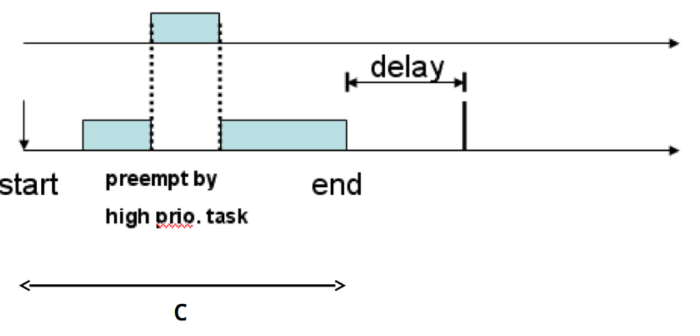

Hw01-Homework for uC/OS-II
---
1. uC/OS-II的多任务实验

# 1. 固定优先级调度
1. uC / OS-II支持固定优先级调度
2. 易于实施RM

# 2. 周期任务

## 调用OSTaskCreate来创建任务
```c++
//A straightforward emulation of (c,p)
while(1){
  Start=OSTimeGet() ;
  While(OStimeGet()-start < c) ;
  OSTimeDly (p-c) ;
}
```



# 3. 定义
1. 实施两组定期任务。
   1. TaskSet 1 = {t1(1,3), t2(3,6)}
   2. TaskSet 2 = {t1(1,3), t2(3,6), t3(4,9) }}
   3. 任务到达时间均为0
   4. 显示上下文切换行为
   5. 显示违反期限的情况

# 4. 经验教训
1. 如何创建在每p单位时间中精确执行c单位时间的任务？（c，p）
2. 我们可以在内核中的哪个位置添加用于观察上下文切换行为的代码？
  
# 5. 注意
1. 在实时应用程序中，确定任务周期，并通过硬件中断调用任务调用
2. 任务计算时间由最坏情况计算时间分析（WCET）确定
3. 在此项目中，我们将模拟这种行为，更重要的是，获得有关如何将CPU时间分配给任务的见解