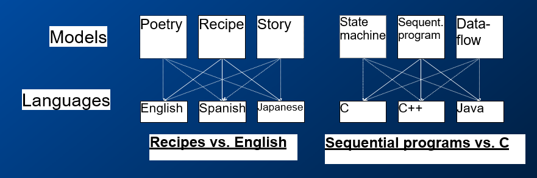

Lec08-嵌入式系统建模
---

# 1. 建模、设计、分析
1. 建模是通过模仿来加深对系统的理解的过程。 模型指定系统的功能。
2. 设计是构件的结构化创建。 它指定系统如何执行操作。
3. 分析是通过解剖来加深对系统的了解的过程。它指定了系统为什么要执行其工作（或未能执行模型说明的应做的工作）。

## 1.1. 什么是建模？
1. 通过模仿获得对系统，流程或工件的见解。
2. 模型是模仿目标系统，流程或目标的工件。
3. 从最抽象的意义上讲，建模是一种方法，其中创建一些表示来描述和/或传达通过系统实现不容易，自然或充分捕获的系统方面
4. 数学模型是一组定义和数学公式形式的模型。

## 1.2. 好的模型
1. 简单
2. 适合理论发展
   1. 定理允许概括和捷径
   2. 不应太笼统（定理变得太弱）
3. 高表现力:紧凑的外观实现更高的生产率
4. 提供批判性推理能:
5. 可执行:模拟/验证
6. 可综合:通常需要设计正交性（例如编译器）
7. 不受任何具体实施的偏见:极难实现，但值得。
8. 适合手头的任务:如果模型不合适，则需要太多工作来使用它

## 1.3. 通用系统模型
1. 状态导向模式：有限状态机
2. 面向活动的模型：把系统描绘成一组与数据或者执行的相关性有关的活动的集合；
3. 面向结构的模型
   1. 框图
   2. 着重强调系统的物理构成
4. 面向数据的模型：实体-关系图
5. 异构模型
   1. 综合前四种模型特征
   2. 表达复杂系统的不同视图What is Model-Based Design?

## 1.4. 什么是基于模型的设计？
1. 创建嵌入式系统所有部分的数学模型
   1. 物理世界
   2. 控制系统
   3. 软件环境
   4. 硬件平台
   5. 网络
   6. 传感器和执行器
2. 根据模型构建实施
   1. 目标：像编译器一样自动执行此构造
   2. 实际上，只有部分是自动构建的

## 1.5. 建模技术
1. 模型是系统动力学的抽象（事物随时间变化的方式）
2. 例子：
   1. 建模物理现象– ODE
   2. 反馈控制系统–时域建模
   3. 模态行为建模– FSM，混合自动机
   4. 传感器和执行器建模–校准，噪声
   5. 建模软件–并发实时模型
   6. 网络建模–延迟，错误率，丢包

## 1.6. 计算分类法
1. “常规”与“事件驱动”
   1. 常规示例：流应用程序，处理器，…
   2. 事件驱动：“反应性”（因环境变化而触发）
2. 即时的
   1. 硬期限与软期限
   2. 定期与非定期
3. 控制，数据，通讯：每个多少？
4. 平行度，地理距离：高度并发与顺序； 分布式系统
5. 确定性与非确定性：可预测程度

## 1.7. 建模，语言和工具
1. 计算模型是用于捕获系统行为的概念性概念，例如：
   1. 一组对象
   2. 组成规则
   3. 执行语义
2. 语言定义语法以捕获计算模型
3. 工具是“编译器”，可以将一种语言捕获的模型转换为另一种语言捕获的模型


## 1.8. 建模和语言
1. 运算模型描述系统行为，概念，例如配方，顺序程序
2. 语言捕获模型，具体形式，例如英语，C
3. 多种语言可以捕获一种模型，例如，顺序程序模型C，C ++，Java
4. 一种语言可以捕获多种模型，例如，C ++→顺序程序模型，面向对象的模型，状态机模型
5. 某些语言更擅长捕获某些计算模型



## 1.9. 什么时候以及为什么要对嵌入式系统建模？
1. 通过使用现代建模软件工具，您可以在离线仿真中设计并执行初始验证。
2. 然后，您可以使用模型来构成所有后续开发阶段的基础。
3. 通过在整个开发过程中执行验证和确认测试，将建模与硬件原型相结合将减少出错的风险并缩短开发周期。
4. 以系统模型为基础，可以更快，更可靠地进行设计评估和预测。
5. 这种迭代方法可以在性能和可靠性方面改进设计。
6. 由于设计团队，设计阶段和各种项目之间模型的可重用性以及对物理原型的依赖性降低，资源成本得以降低。
7. 通过使用自动代码生成技术，可以减少开发错误和开销。

## 1.10. 软件建模
1. 对于工程和设计任务，尤其是与嵌入式系统有关的任务，通常使用某种形式的软件建模作为粗化或构建整个应用程序设计的初始方法。
   1. 一些软件模型是行为模型；
   2. 有些仅仅是用于理解和设计的视觉辅助工具，
   3. 其他被更多地用作框架，以确保相似应用程序之间的一致性或促进工程师团队之间的通信。
   4. 嵌入式系统设计人员面临的挑战是知道哪种类型和级别的建模最适合他们独特的情况和眼前的问题。

### 1.10.1. 建模语言的核心方面


### 1.10.2. 一种标准的嵌入式控制系统模式


### 1.10.3. 建模语言的例子


### 1.10.4. C code: textual, execution, implementation language
```c
previous_error = setpoint - process_feedback integral = 0
start:
  wait(dt)
  error = setpoint - process_feedback integral = integral + (error*dt) derivative = (error - previous_error)/dt
  output = (Kp*error) + (Ki*integral) + (Kd*derivative) previous_error = error
goto start
```

### 1.10.5. 各种图片


## 1.11. 为什么要对嵌入式系统建模？
1. 集成良好的建模方法可以大大减少系统文档，设计，测试，和实际实施。
2. 除了上面列出的主要优点外，对于某些嵌入式系统问题，建模方法还直接带来了额外的效率和准确性。

## 1.12. 什么时候应该对嵌入式系统建模？
1. 关键任务和安全关键型应用
2. 高度复杂的应用程序和系统
3. 大型开发团队
4. 如果无法选择原型，则别无选择。

## 1.13. 有限状态机
1. 根据维基百科，有限状态机是：
   - 用于设计计算机程序的行为模型。 它由与转换相关联的有限数量的状态组成。转换是一组从一个状态开始并在另一（或相同）状态结束的动作。转换是由触发器启动的，并且触发器可以是 事件或条件。
   - FSM =（
     - {输入符号}，
     - {输出符号}，
     - {状态}，
     - {初始状态}，
     - 过渡关系（输入符号，当前状态到下一个状态的映射）
     - 输出功能（输入符号，当前状态到当前输出符号的映射）
   - ）
2. 通常适用于控制器，协议
3. 强大的验证算法
4. 易于综合，但效率低下

## 1.14. 什么是模型？
1. 系统输入/输出序列建模
   1. 在给定时间出现的“状态”属性集，“输入”和“输出”是系统的可观察特征
   2. 允许或观察到的“过渡”状态成对排序，从输入/输出序列中推断出状态和转换
   3. 如果输出仅取决于状态Moore，则为Mealy FSM
2. 关键假设：可用于状态以及输入和输出符号字母的总内存是有限的。

## 1.15. Application
1. Vending Machines
2. Traffic Lights
3. Video Games
4. Text Parsing
5. Regular Expression Matching
6. CPU Controllers
7. Protocol Analysis
8. Natural Language Processing
9. Speech Recognition

## 1.16. FSM示例模型
1. 非正式规格：如果驾驶员打开钥匙并在5秒钟内没有系紧安全带，则发出警报5秒钟或直到驾驶员系紧安全带或关闭钥匙
2. 正式代表
   1. 输入= {KEY_ON，KEY_OFF，BELT_ON，BELT_OFF，5_SECONDS_UP，10_SECONDS_UP}
   2. 输出= {START_TIMER，ALARM_ON，ALARM_OFF}
   3. 状态= {关闭，等待，报警}
   4. 初始状态=关
   5. NextState：CurrentState，输入-> NextState
   6. 例如 NextState（WAIT，{KEY_OFF}）= OFF
3. 输出：CurrentState，输入->输出，例如 Outs（OFF，{KEY_ON}）= START_TIMER


29页开始

作业:类似安全带的例子，包含状态机和数学模型