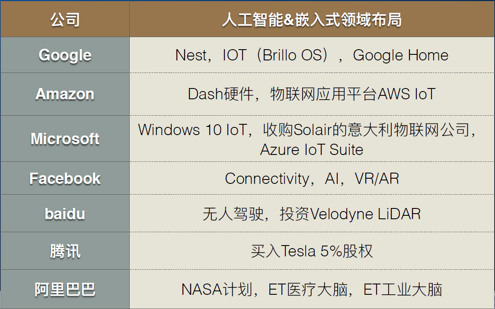

lec0-嵌入式系统概论导言
---

# 1. 引入——中美关系、近期热点
1. 芯片
2. 产业链
3. M2M(Mechine To Mechine)、工业化4.0、中国制造2025

## 1.1. 嵌入式巨头布局

## 1.2. 发展模式
1. 互动社区
2. 众筹平台
3. 开源软件
4. 产品主导

## 1.3. 格言
1. 预见未来的最好方式就是亲手创造未来。
2. 对待软件严肃认真的人，应该制造自己专属的硬件。

# 2. 嵌入式软件越来越复杂
1. 95%+的软件系统实际上是嵌⼊的
2. 1960战机包含5万行，F22猛禽250万行
3. 新型汽车超过一亿行代码

# 3. 考核方式
1. 笔试：60%
2. 作业(C)：40%，C/C++
3. 所需技能:Linux、C/C++、Python、JS、GO