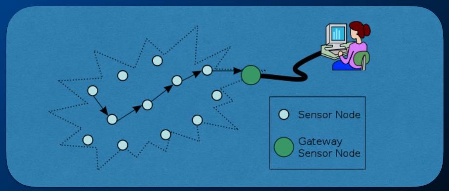
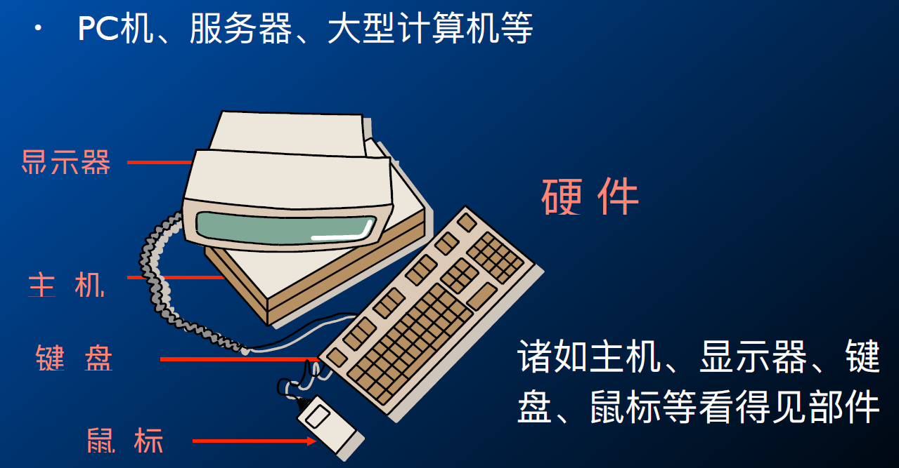
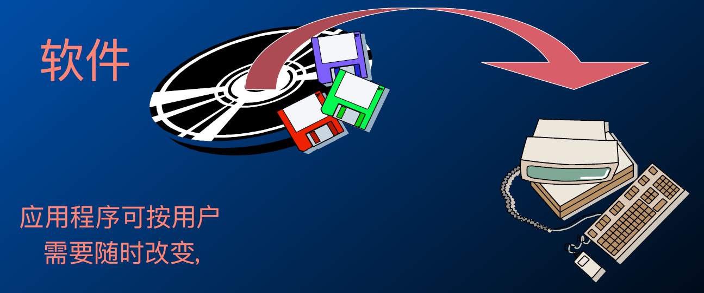
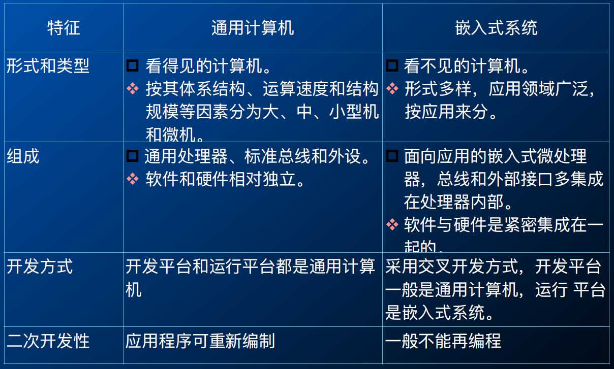
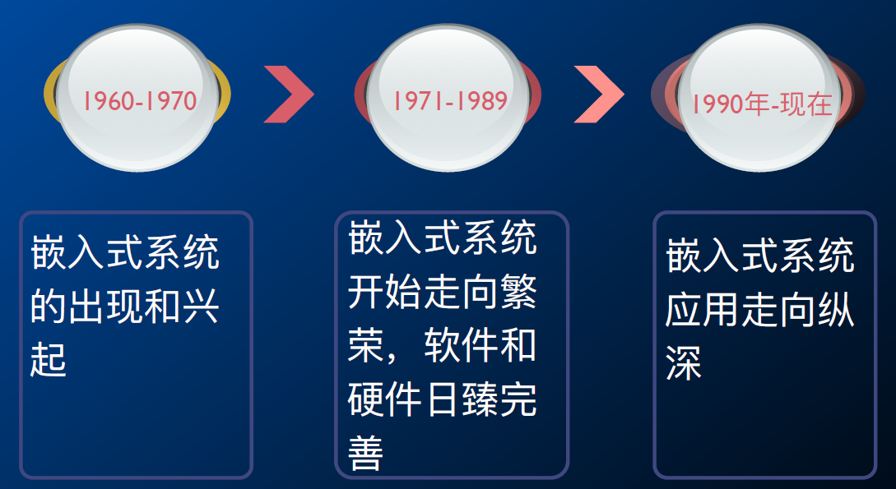
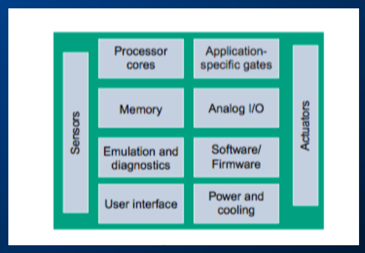
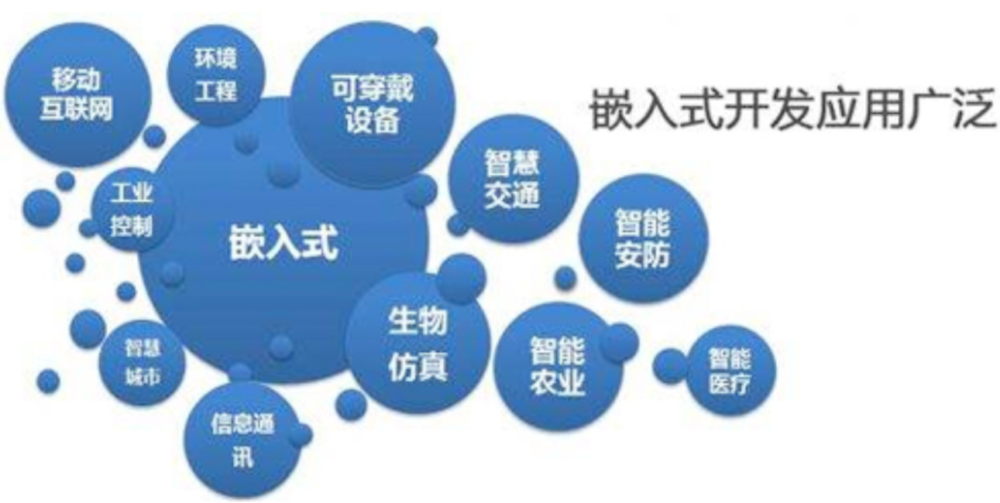
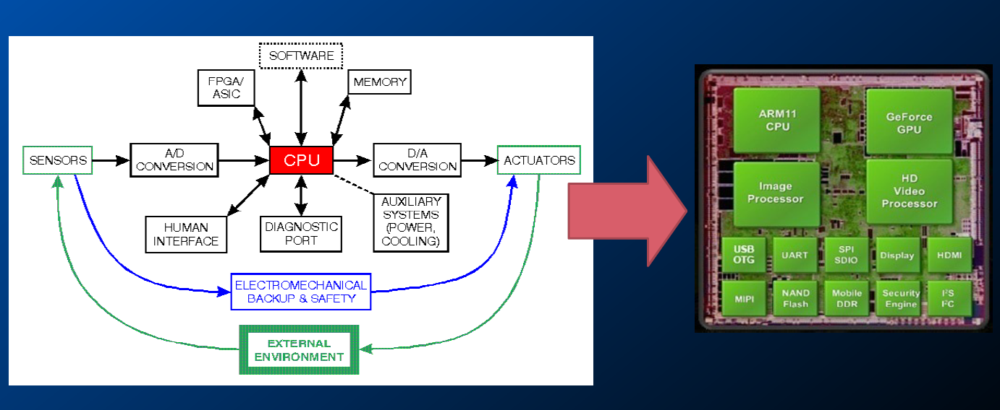

Lec01-嵌入式系统概论
---

# 1. 计算机发展阶段

1. 从长远来看，PC机和计算机工作站将衰落，计算机将要小型化，并且变得无处不在 —— "无处不在的计算机"

# 2. 嵌入式系统
1. 随着计算机技术、网络技术和微电子技术的快速发展，人们进入了后PC时代，后PC时代是一个**嵌入式系统Embedded System**的网络时代，嵌入式技术将主宰后PC时代。
2. "嵌入式系统"实际上是"嵌入式计算机系统"的简称。
3. 以下是对嵌入式系统的不同定义

## 2.1. IEEE的定义
1. 嵌入式系统是用于**控制、监视或者辅助操作机器和设备的装置**。
2. 此定义时从应用上考虑的，嵌入式系统是软件和硬件的综合体，还可以涵盖机电等附属装置。
  
## 2.2. 国内的定义
1. 嵌入式系统是**以应用为中心，以计算机技术为基础，软硬件可裁减，适用于应用系统对功能、可靠性、成本、体积、功耗有严格要求的专用计算机系统**。
   1. 嵌入式设备是用于特定的设备
   2. 计算机技术为基础，必须要有计算
   3. 软硬件可裁剪:印证了专用设备的特点，将不需要的设备裁剪掉
2. 嵌入式系统就是一个具有特定功能或用途的隐藏在某种设备中的计算机软硬件集合体，没有固定的特征形状。
3. 嵌入的可以不是设备，而是生产流程，这样的系统也是嵌入式系统

## 2.3. 其他的定义
1. 看不见的计算机，一般不能被用户编程, 它有一些专用的I/O设备, 对用户的接口是应用专用的。
2. 嵌入式系统是包含在某些较大的设备或产品中的计算机系统，其目的是为该设备提供**监视和控制**服务。
3. 包括可编程计算机在内但本身**不打算用作通用计算机**的任何设备。
4. 包含有计算机，但又不是通用计算机的计算机应用系统。

## 2.4. 嵌入式系统三要素
1. 嵌入:嵌入性，嵌入到对象体系中，有对象环境要求
2. 专用:专用型，软硬件按对象要求设计、裁剪
3. 计算机:实现对象的智能化功能

## 2.5. 嵌入式系统示例

### 2.5.1. 无线感知网络
1. 无线感知网络，是由许多在空间中分布的自动装置组成的一种无线通信计算机网络。
2. 这些装置使用传感器器协作地监控不同位置的物理或环境状况(比如温度、声音、振动、压力、运动或污染物)。
3. 无线传感器网络的发展最初起源于战场监测等军事应用。而现今无线传感器网络被应用于很多民用领域，如环境与生态监测、健康监护、家居自动化以及交通控制等。
4. 特点:低功耗、低成本

> 绿色的是(数据)汇聚节点，相当于网关，有一定的算力和存储。

### 2.5.2. 传感器
1. 传感器:将非电信号转换为电信号，用来感知和度量外部世界，并将其转换为计算机可度量的电信号。比如温湿度、酸碱度传感器等。
2. 传感器内部有计算单元，类似电脑的CPU
3. 一定要有电源管理，包含软件和硬件两种方式，不然设备工作时间会比较短。

### 2.5.3. 物联网(IOT)
1. 物联网IoT是物理设备，车辆(也称为"连接设备"和"智能设备")，建筑物以及其他嵌入电子设备，软件，传感器，执行器和网络的物品的互连网络 连接性，使这些对象能够收集和交换数据。
2. RFID，工业标签:用来识别和标识物体

## 2.6. 网络物理系统
1. 网络物理系统(CPS，Cyber-physical System)是一种由基于计算机的算法控制或监视的机制，与互联网及其用户紧密集成。
2. 深度融合了各类信息技术：传感器、嵌入式计算、云计算、网络通信、软件，使得各种信息化能力(3C：计算-Computer、通信-Communication和控制-Control)高度协同和自治，实现生产应用系统自主、智能、动态、系统化地监视并改变物理世界的性状。

# 3. 通用计算机：看得见的计算机
|  |  |
| ------------------- | ------------------- |

# 4. 嵌入式系统应用
1. 工控设备
2. 军用电子设备
3. 航天／航空
4. 汽车电子
5. 信息家电
6. 通信
7. 智能玩具
8. 可穿戴
9. 更多的场景，见PPT-lecture1

# 5. 嵌入式系统的发展历程

# 6. 嵌入式系统的组成
1. 嵌入式系统一般由**嵌入式硬件和软件**组成
2. 硬件以**微处理器**为核心集成存储器和系统专用的**输入/输出设备**
3. 软件包括：**初始化代码及驱动、嵌入式操作系统和应用程序**等，这些软件有机地结合在一起，形成系统特定的一体化软件。

|                     |                     |
| ------------------- | ------------------- |
|  |  |

- 中间件:ROS
- 执行器:电动机、马达

# 7. 嵌入式系统的特点
1. 嵌入式系统通常是**形式多样、面向特定应用**的
2. 嵌入式系统得到**多种类型的处理器和处理器体系结构**的支持
3. 嵌入式系统通常极其关注**成本**
4. 嵌入式系统有**实时性和可靠性**的要求
5. 嵌入式系统使用的操作系统一般是**适应多种处理器、可剪裁、轻量型、实时可靠、可固化**的嵌入式操作系统
6. 嵌入式系统开发需要**专门工具和特殊方法**

## 7.1. 形式多样、面向特定应用
1. 一般用于特定的任务，其听见和软件都必须高效率地设计，量体裁衣、去除冗余，而通用计算机则是一个通用的计算平台。
2. 它通常都具有**低能耗、体积小、集成度高**等特点，能够把通用微处理器中许多由板卡完成的任务集成在芯片内部。
3. 嵌入式软件是应用程序和操作系统两种软件的一体化程序。

## 7.2. 处理器和处理器体系结构类型多
1. 通用计算机采用少数的处理器类型和体系结构，而且主要掌握在少数大公司手里。
2. 嵌入式系统可采用多种类型的处理器和处理器体系结构，有上千种的嵌入式微处理器和几十种嵌入式微处理器体系结构可以选择。
3. 在嵌入式微处理器产业链上，IP设计、面向应用的特定嵌入式微处理器的设计、芯片的制造已形成巨大的产业。分工协作，形成多赢模式。

## 7.3. 关注成本
1. 嵌入式系统通常需要注意的成本是系统成本，特别是量⼤的消费类数字化产品，其成本是产品竞争的关键因素之⼀。
2. 嵌入式的系统成本包括:
   1. 一次性的开发成本：NRE(Non-Recurring Engineering)成本
   2. 产品成本:硬件BOM、外壳包装和软件版税等
   3. 批量产品的总体成本 = NRE成本 + 每个产品成本 * 产品总量
   4. 每个产品的最后成本 = 总体成本/产品总量 = NRE成本/产品总量 + 每个产品成本

## 7.4. 实时性和可靠性的要求
1. 一方面大多数实时系统都是嵌入式系统。
2. 另一方面嵌入式系统多数有实时性的要求，软件一般是固化运⾏或直接加载到内存中运⾏，具有快速启动的功能。
3. 嵌入式系统⼀般要求具有出错处理和自动复位功能，特别是对于⼀些在极端环境下运⾏的嵌入式系统⽽⾔，其可靠性设计尤其重要。
4. 在⼤多数嵌入式系统的软件中⼀般都包括⼀些机制，⽐如硬件的看门狗定时器，软件的内存保护和重启动机制。

## 7.5. 适应多种处理器、可剪裁、轻量型、实时可靠、可固化的嵌入式操作系统
1. 由于嵌入式系统应⽤的特点，像嵌入式微处理器⼀样，嵌入式操作系统也是多姿多彩的。
2. ⼤多数商业嵌入式操作系统可同时⽀持不同种类的嵌入式微处理器。可根据应⽤的情况进⾏剪裁、配置。
3. 嵌入式操作系统规模⼩，所需的资源有限如内核规模在⼏⼗KB，能与应⽤软件⼀样固化运⾏。
4. ⼀般包括⼀个实时内核，其调度算法⼀般采⽤基于优先级的可抢占的调度算法。
5. ⾼可靠嵌入式操作系统：时、空、数据隔离。

## 7.6. 开发需要专门工具和特殊方法
1. 由于嵌入式系统资源有限，⼀般不具备⾃主开发能⼒，产品发布后⽤户通常也不能对其中的软件进⾏修改，必须有⼀套专⻔的开发环境。
2. 该开发环境包括专⻔的开发⼯具(包括设计、编译、调试、测试等⼯具)，采⽤交叉开发的⽅式进⾏。

# 8. 嵌入式系统的分类
1. 按嵌入式处理器的位数来分类
2. 按应用来分类
3. 按速度分类
4. 按确定性来分类
5. 按嵌入式系统软件复杂程度来分类

## 8.1. 按嵌入式处理器的位数来分类
1. 4位嵌入式系统:大量应用
2. 8位嵌入式系统:大量应用
3. 16位嵌入式系统:大量应用
4. 32位嵌入式系统:正成为主流发展趋势
5. 64位嵌入式系统:高度复杂的、高速的嵌入式系统已经开始采用

## 8.2. 按应用来分类

## 8.3. 按速度分类
1. 强实时系统, 其系统响应时间在毫秒或微秒级。
2. ⼀般实时系统, 其系统响应时间在⼏秒的数量级上,其实时性的要求⽐强实时系统要差⼀些。
3. 弱实时系统, 其系统响应时间约为数⼗秒或更⻓。这种系统的响应时间可能随系统负载的轻重⽽变化。

## 8.4. 按确定性来分类
1. 根据确定性的强弱，可将嵌入式系统分为硬实时、软实时系统：
   1. 硬实时：系统对系统响应时间有严格的要求，如果系统响应时间不能满⾜，就要引起系统崩溃或致命的错误。
   2. 软实时：系统对系统响应时间有要求，但是如果系统响应时间不能满⾜，不会导致系统出现致命的错误或崩溃。
2. 这个是很重要的

## 8.5. 按嵌入式系统软件复杂程度来分类
1. 循环轮询系统
2. 有限状态机系统
3. 前后台系统
4. 单处理器多任务系统
5. 多处理器多任务系统

## 8.6. 最近的发展趋势
1. 嵌入式人工智能
2. 安全
3. 持续提高的计算需求和复杂度要求：机顶盒中的多媒体处理，HDTV，多核，深度学习
4. 持续的网络
5. 对于灵活性需求的不断提高:不断变化的标准下的上市时间
6. HW-SW共同设计
7. 更高的集成度：同一芯片上有更多块
8. IP重用，基于平台的设计，NoC与 总线
   1. ⽤于ASIC或FPGA中的预先设计好的电路功能模块
9.  设计方法的多样性，依赖平台，缺乏标准
10. cloud, edge computing
11. TTM:跳票

## 8.7. 嵌入式人工智能
1. 嵌入式人工智能于各⾏业垂直领域应⽤具有巨⼤的潜⼒
2. 嵌入式人工智能取代屏幕成为新UI / UX接⼝
3. 嵌入式人工智能芯⽚
4. 嵌入式人工智能⾃主学习是终极⽬标

## 8.8. 嵌入式系统安全
1. 数据存储不安全
2. 服务端控制措施部署不当
3. 传输过程中没有加密
4. 身份认证措施不当
5. 密钥保护措施不当
6. 会话处理不当
7. 敏感数据泄漏

## 8.9. System-on-Chip (SoC) 片上系统
1. SoC指将电子系统的所有组件集成到单个芯片中(促使这种集成的动机是什么)：
   1. 微处理器，微控制器，DSP
   2. ASIC’s, FPGA’s
   3. 内存，IO涉笔，A / D和D / C转换器
   4. 模拟，混合信号，RF模块，稳压器
2. 通信基础设施：基于总线的片上网络(NoC)。
3. 系统级设计(自动化)以及同时优化众多设计指标是关键挑战。
4. SoC是一个复杂的嵌入式系统。

## 8.10. 集成度不断提高：复杂的嵌入式系统-> SoC

# 9. 互联的价值
1. 嵌入式设备的互联性可提⾼对各种服务、内容和信息的访问能力
2. 为动态修改嵌入式软件提供了可能，如:
   1. 修改系统代码或"固件"
   2. 增添新的应⽤软件模块
3. 增强了系统和设备的可管理性