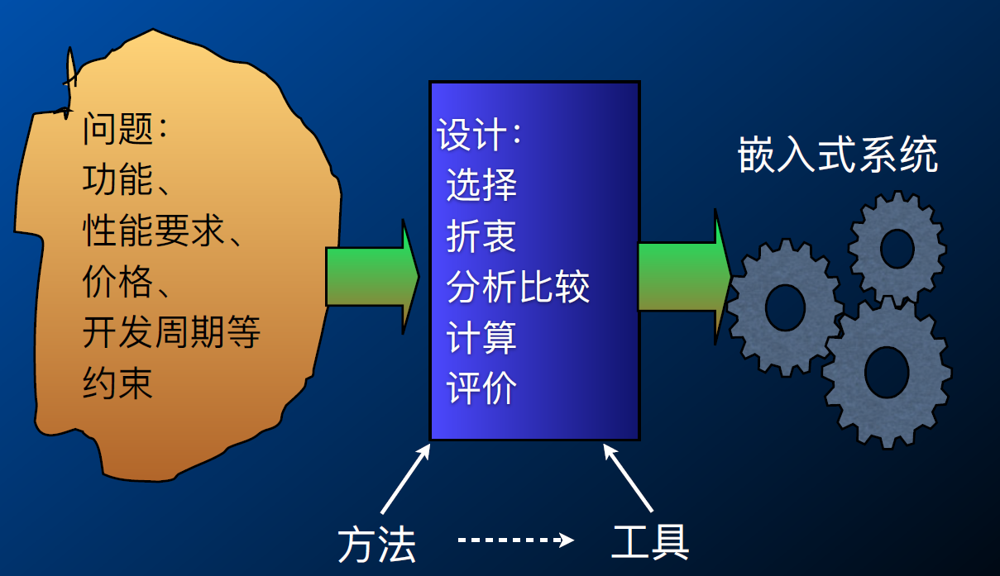
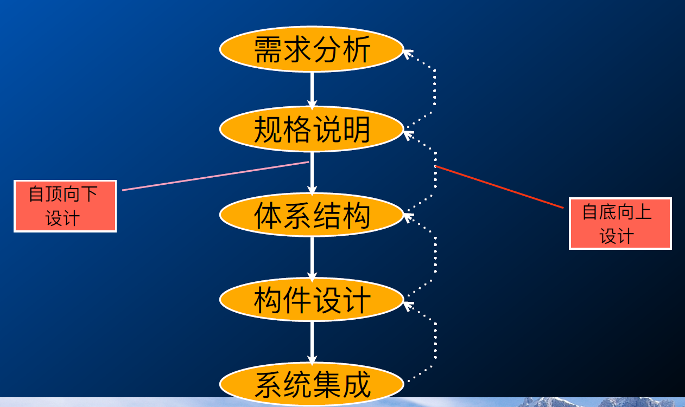
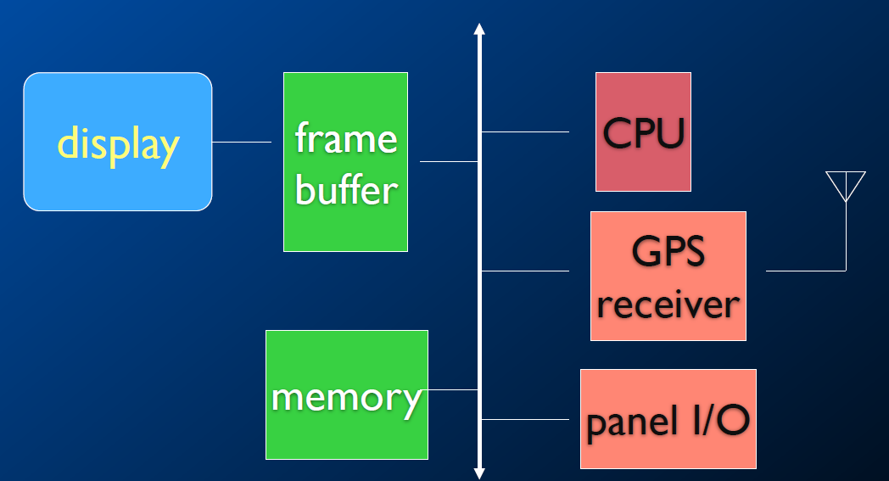
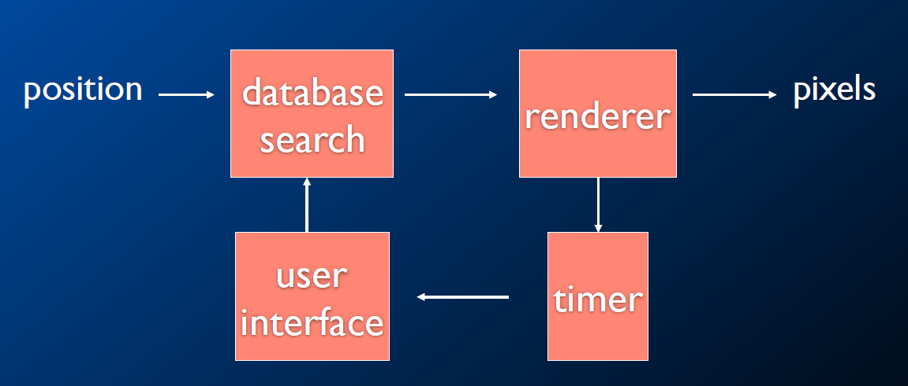
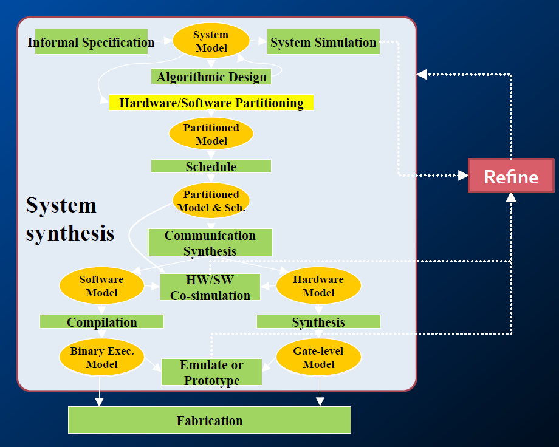
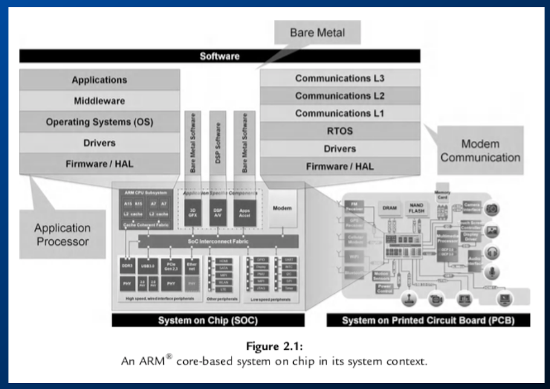
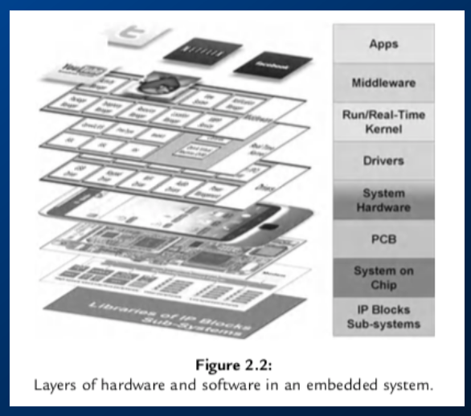

lec02-嵌入式系统设计方法
---

# 1. 嵌入式系统设计所面临的挑战
1. 需要多少硬件？
2. 如何满足时限要求，如何处理理多项功能在时间上的协调一致关系？
3. 如何降低系统的功耗？
4. 如何设计以保证系统可升级？
5. 如何保证系统可靠地工作？

# 2. 嵌入式系统设计者要求
1. 懂得系统的整个构架
2. 详细了解硬件的细节
3. 软件设计满足：实时要求、低功耗、代码量小
4. 详细了解领域知识

# 3. 嵌入式系统的设计过程

| 嵌入式系统的设计过程 | 嵌入式系统的设计过程的基本流程 |
| -------------------- | ------------------------------ |
|   |             |

# 4. 示例：GPS移动地图
1. 移动地图从GPS获取位置，从本地数据库绘制地图。

## 4.1. 架构设计
1. 哪些主要组件符合规格？
   1. 硬件:CPU，外围设备等
   2. 软件:主要程序及其操作。
2. 必须考虑功能和非功能规范。

## 4.2. 设计硬件和软件组件
1. 在开始编码之前，必须花时间设计系统。
2. 有些组件是现成的，有些可以从现有设计中进行修改，而另一些则必须从头开始设计。

## 4.3. GPS移动地图架构图

| 总体体系结构        | 硬件架构            | 软件架构            |
| ------------------- | ------------------- | ------------------- |
|  |  |  |

# 5. 软硬件的划分
1. 嵌入式系统的设计涉及硬件与软件部件，设计中必须决定什么功能由硬件实现，什么功能由软件实现。
2. 硬件和软件具有双重性
3. 软硬件变动对系统的决策造成影响
4. 划分和选择需要考虑多种因素
5. 硬件和软件的双重性是划分决策的前提

## 5.1. 通常由软件实现的部分
1. 操作系统功能：任务调度、资源管理、设备驱动
2. 协议栈:TCP/IP
3. 应用软件框架
4. 除基本系统、物理理接口、基本逻辑电路，许多由硬件实现的功能都可以由软件实现。

## 5.2. 双重性部分
1. 算法：加密/解密、编码/解码、压缩/解压。
2. 数学运算:浮点运算、FFT。

## 5.3. 软硬件技术对系统结构的影响
1. 硬软件设计的趋势：融合、渗透
   1. 硬件设计的软件化：VHDL、Verilog、HANDL-C
   1. 软件实现的硬件化:各种算法的ASIC
2. 对系统设计的影响：协同设计
   1. 增加灵活性
   2. 增加了风险
   
# 6. 嵌入式系统设计方法学

## 6.1. 嵌入式系统设计方法的演变
1. 以PCB、CAD和在线仿真器器为主要工具
2. 以EDA和EOS为开发平台
3. 以IP内核库为设计基础，用软硬件协同设计技术的系统级设计方法

## 6.2. 传统的嵌入式系统设计过程
1. 传统软硬件设计过程的基本特征:
   1. 系统在一开始就被划分为软件和硬件两大部分
   2. 软件和硬件独立进行行开发设计
   3. “Hardware first” approach often adopted
2. 隐含的一些问题:
   1. 软硬件之间的交互受到很大限制：凭经验划分软硬件、软硬件之间的相互性能影响很难评估
   2. 系统集成相对滞后，NRE较大，越后期发现的问题可能会导致越严重的开销
   3. 从上到下越早开始集成越好
3. 因此：设计质量差、设计修改代价高、研制周期不能有保障

## 6.3. 硬件/软件协同设计(HW/SW Co-design )
1. 硬件/软件协同设计是指一种专用系统的设计，该系统由几个专用IC组成，这些IC与通用处理器上的软件过程配合使用（1994年）
2. 硬件/软件协同设计意味着通过并发设计来利用硬件和软件的协同作用，从而达到系统级目标（1997年）
3. 硬件/软件协同设计试图通过提供可以告诉设计人员系统是否满足其性能，功耗和尺寸目标的分析方法以及可以使设计人员快速评估许多潜在设计方法的综合方法，来提高嵌入式系统设计的可预测性（2003年）
4. 它从新兴学科（90年代初）发展为主流技术（今天）

## 6.4. 简单的设计流程:部分是硬件开发，部分是软件开发

|                     |                     |
| ------------------- | ------------------- |
|  |  |

## 6.5. 结构说明图
- 从系统开始到系统完成的全过程

|   |  |
| -------------------- | -------------------- |
|  |  |

> 下图中的+表示好

## 6.6. 设计目标
成本、表现、电源、区域、可扩展性和可重用性、容错能力、热特性