lec05-Bus
---
1. ISR，Interrupt Service Routine，中断服务历程

# 1. 输入输出

## 1.1. I/O设备
1. 通常包括一些非数字组件。
2. 典型的CPU数字接口：

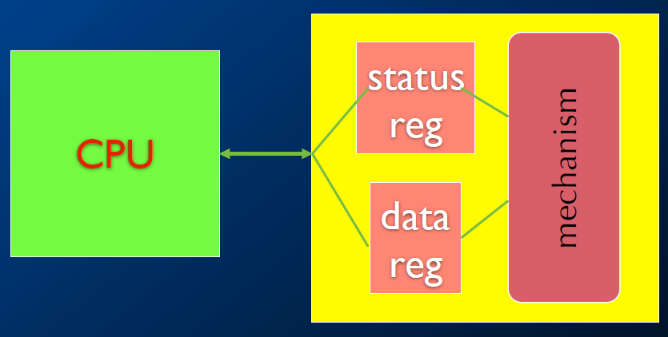

## 1.2. 应用：8251 UART
1. 通用异步接收器发送器(UART)：提供串行通信。
2. 允许对许多通信参数进行编程。

## 1.3. 串行通讯
1. 字符分别传输：


- 串行通讯参数
  1. 波特率
  2. 每个字符的位数
  3. 奇偶校验/无奇偶校验：奇偶校验
  4. 停止位的长度(1、1.5、2位)

## 1.4. CPU接口
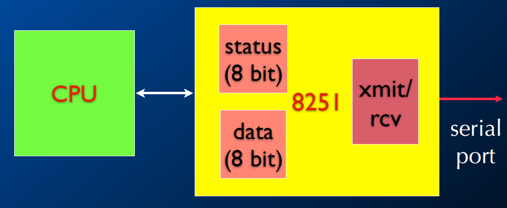

## 1.5. I/O设备分类

### 1.5.1. 从从属角度进行分类
1. 系统设备：操作系统启动时已经在系统中注册的标准设备。
   1. 示例包括NOR / NAND闪存，触摸板等。
   2. 操作系统中有用于这些设备的设备驱动程序和管理程序。
   3. 用户应用程序只需调用操作系统提供的标准命令或功能即可使用这些设备。
2. 用户设备：操作系统启动时未在系统中注册的非标准设备。
   1. 通常，设备驱动程序由用户提供。用户必须以某种方式将这些设备的控制权转移到OS进行管理。
   2. 典型的设备包括SD卡，USB磁盘等。

### 1.5.2. 使用类别
1. 专用设备：一次只能由一个进程使用的设备。对于多个并发进程，每个进程互斥地使用设备。一旦操作系统将设备分配给特定进程，它将由该进程专有，直到该进程在使用后释放它为止。
2. 共享设备：一次可以由多个进程寻址的设备。共享设备必须是可寻址的，并且是随机寻址的。共享设备机制可以提高每个设备的利用率。
3. 虚拟设备：利用虚拟化技术从物理设备转移到多个逻辑设备的设备。传输的设备称为虚拟设备。

### 1.5.3. 特征类别
1. 存储设备：
   - 此类型的设备用于存储信息。
   - 嵌入式系统中的典型示例包括硬盘，固态磁盘，NOR / NAND闪存。
2. I/O设备：
   1. 输入设备：输入设备负责将信息从外部源输入到内部系统，例如触摸面板，条形码扫描仪等。
   2. 输出设备：输出设备负责将嵌入式系统处理的信息输出到外部世界，例如LCD显示器，扬声器等。

### 1.5.4. 信息传递单位类别
1. 块设备：这种类型的设备以数据块为单位组织和交换数据。
   1. 它是一种结构装置。
   2. 典型的设备是硬盘。
   3. 在I/O操作中，即使只是单字节读/写，也应该读取或写入整个数据块。
2. 字符设备：这种类型的设备以字符为单位组织和交换数据。
   1. 它是一种非结构性的设备。
   2. 字符设备的类型很多，例如串行端口，触摸面板，打印机。
   3. 字符设备的基本特征是传输速率低且无法寻址。当字符设备执行I/O操作时，通常使用中断。

## 1.6. I/O设备组成
1. 通常，I/O设备由两部分组成：机械零件和电子零件：电子部分称为设备控制器或适配器。

### 1.6.1. 可编程I/O
1. 通信期间选择控制寄存器或数据缓冲区的三种方法
   1. 独立的I/O端口：需要专门的指令来完成。
   2. 内存映射的I/O。
   3. 混合解决方案(统一编址)。混合模型包括内存映射的I/O数据缓冲区和用于控制寄存器的单独的I/O端口。
2. 英特尔x86提供了输入输出说明。大多数其他CPU使用内存映射的I/O。
3. I/O指令不排除内存映射的I/O。


1. 独立的I/O和内存空间。
2. 内存映射的I/O。
3. 混合解决方案。

### 1.6.2. 内存映射的I/O
1. 内存映射I/O的优点可总结为：
   1. 在内存映射的I/O模式下，设备控制寄存器只是内存中的变量，并且可以与其他变量一样用C寻址。因此，可以完全用C语言编写I/O设备驱动程序。
   2. 在这种模式下，不需要特殊的保护机制即可阻止用户进程执行I/O操作。
2. 内存映射I/O模式的缺点可以总结为：
   1. 当前大多数嵌入式处理器都支持内存缓存。缓存设备控制寄存器将导致灾难。为了防止这种情况，必须为硬件提供选择性禁用缓存的功能。这将增加嵌入式系统中硬件和软件的复杂性。
   2. 如果只有一个地址空间，则所有内存模块和所有I/O设备都必须检查所有内存引用，以便确定要响应的内存引用。这会严重影响系统性能。
3. ARM 内存映射的I/O
   1. 定义设备地址:`DEV1 EQU 0x1000`
   2. 读写代码:

```
LDR r1,#DEV1 ; set up device adrs
LDR r0,[r1] ; read DEV1
LDR r0,#8 ; set up value to write
STR r0,[r1] ; write value to device
```

#### 1.6.2.1. peek and poke：(高级语言)，指针操作要注意
```c++
int peek(char *location) {
   return *location;
}
void poke(char *location, char newval) {
   (*location) = newval;
}
```

#### 1.6.2.2. 在忙/等待输出
```c++
current_char = mystring;
while (*current_char != ‘\0’) {
   poke(OUT_CHAR,*current_char);
   while (peek(OUT_STATUS) != 0);
   current_char++;
}
```

#### 1.6.2.3. 同步忙/等待输入输出:
```c++
while (TRUE) {
   /* read */
   while (peek(IN_STATUS) == 0);
   achar = (char)peek(IN_DATA);
   /* write */
   poke(OUT_DATA,achar);
   poke(OUT_STATUS,1);
   while (peek(OUT_STATUS) != 0);
}
```

### 1.6.3. 中断I/O
1. 在忙和等待是非常低效的。而中断I/O是相对高效的。
   1. CPU在检查设备的时候，不能干别的。
   2. 很难去实现同步I/O
2. 中断允许设备更改CPU中的控制流:导致子例程调用以处理设备。
#### 1.6.3.1. 中断接口

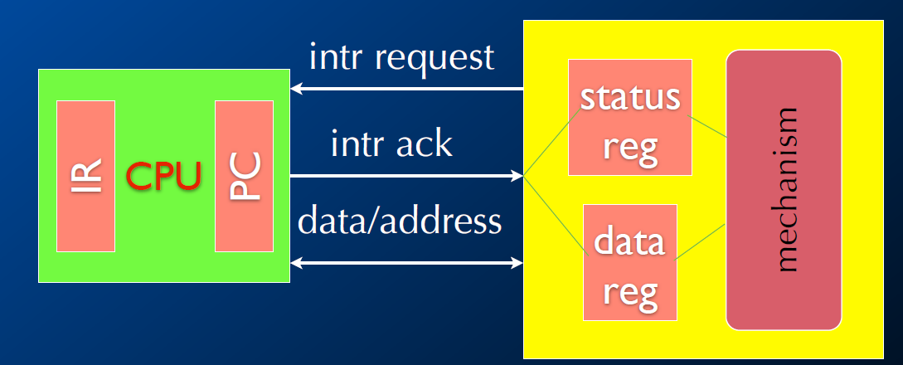

#### 1.6.3.2. 中断行为
1. 基于子程序的调用机制
2. 中断迫使下一条指令成为子程序调用到预定位置。
3. 返回地址被保存以恢复执行前台程序。

#### 1.6.3.3. 中断物理接口
1. CPU和设备通过CPU总线连接。
2. CPU和设备握手：
3. 设备声明中断请求；
4. CPU可以处理中断时会声明中断确认。

#### 1.6.3.4. ISR的例子
```c++
void input_handler() {
   achar = peek(IN_DATA);
   gotchar = TRUE;
   poke(IN_STATUS,0);
}
void output_handler() {
}
```

#### 1.6.3.5. 主程序

```c++
main() {
   while (TRUE) {
      if (gotchar) {
         poke(OUT_DATA,achar);
         poke(OUT_STATUS,1);
         gotchar = FALSE;
      }
   }
   other processing....
}
```

#### 1.6.3.6. 例子:带缓冲区的中断I/O
- 字节流如下。

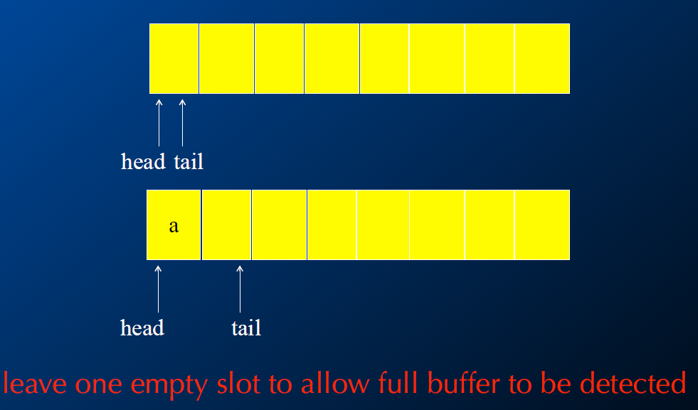

#### 1.6.3.7. I/O时序图

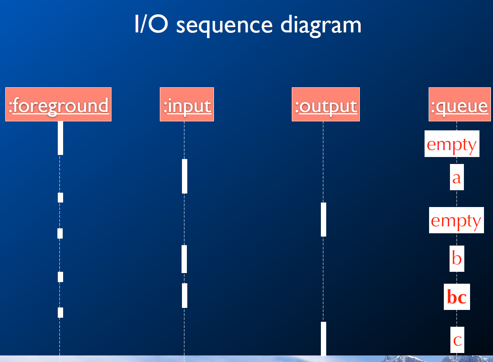

#### 1.6.3.8. 优先级和向量
1. 两种机制使我们可以使中断更具体：
   1. 优先级确定什么中断首先获取CPU。
   2. 向量确定每种中断类型需要调用什么代码。
2. 机制是正交的：大多数CPU都提供两者。


#### 1.6.3.9. 优先级例子
- 中断嵌套收到中断嵌套允许位控制

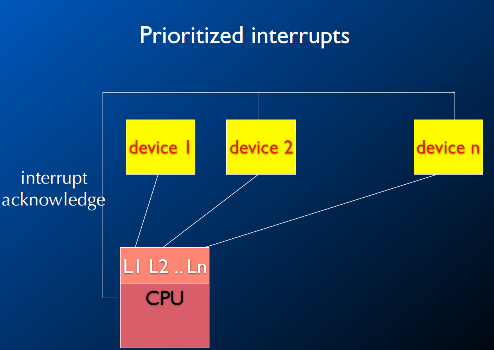

#### 1.6.3.10. 中断优先级
1. **屏蔽**：优先级低于当前优先级的中断直到待处理的中断完成后才被识别。
2. **不可屏蔽中断(NMI)**：最高优先级，从不屏蔽。经常情况下被用于关闭电源。

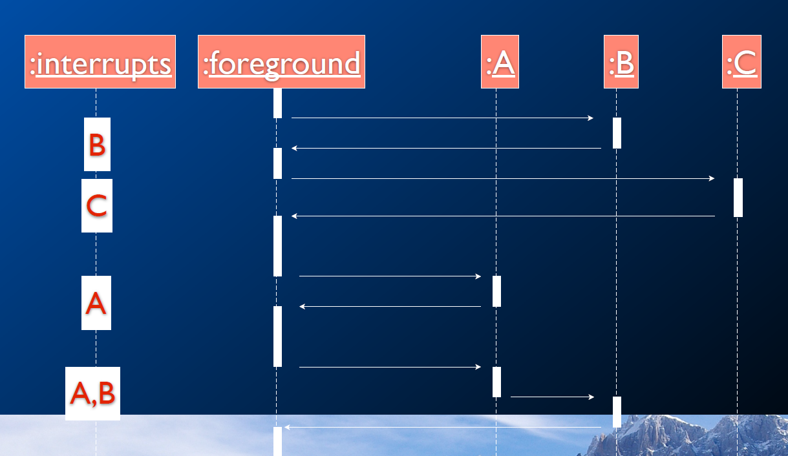

#### 1.6.3.11. 中断向量
1. 允许使用不同的代码处理不同的设备。
2. 中断向量表:可以通过ISR寻找到，放置在起始地址。


#### 1.6.3.12. 中断向量获取

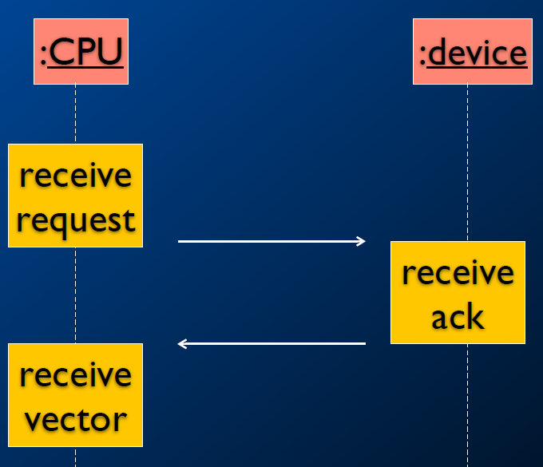

#### 1.6.3.13. 通用状态机

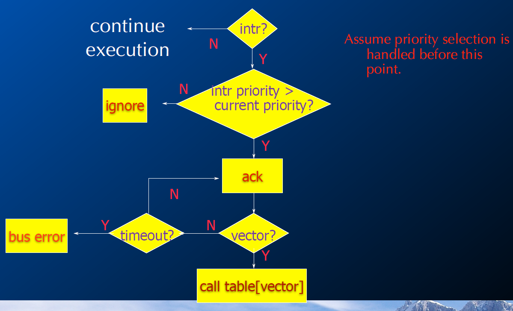

#### 1.6.3.14. 中断序列
1. CPU确认请求。
2. 设备发送引导程序。
3. CPU调用处理程序。
4. 软件流程请求。
5. CPU将状态恢复到前台程序。

#### 1.6.3.15. 中断来源概述
1. 处理程序执行时间。
2. 中断机制开销。
3. 注册保存/恢复
4. 管道相关的罚款。
5. 与缓存有关的惩罚。

# 2. 中断设计准则
1. 虽然很难调试恶意代码，但是恶意ISR实际上是不可辩驳的。
2. 怎么样？
   1. 首先，在绘制中断图之前，甚至不要考虑为新的嵌入式系统编写一行代码。列出每个中断，并给出例程应做的英文描述。
   2. 该地图是预算。它为您提供了一个评估中断时间的地方。
   3. 估算每个ISR的复杂度。
   4. ISR的基本原则是使处理程序简短。
   5. 当然，短是按时间而不是代码大小来衡量的。避免循环。避免使用冗长的复杂指令(重复动作，令人毛骨悚然的数学运算等)。
   6. 在ISR中尽快重新启用中断。先执行对硬件至关重要且不可重入的操作，然后执行中断**使能指令**。给其他ISR一个机会去做他们的事情。

## 2.1. 中断图


## 2.2. 用指向空例程的指针填充所有未使用的中断向量
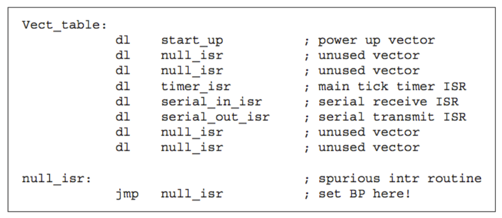

## 2.3. C或汇编
1. 如果例程使用汇编语言，则将时间转换为大约数量的指令。如果一条平均指令需要x微秒(取决于时钟速率，等待状态等)，那么就很容易获得对代码允许的复杂度的关键估计。
2. C更成问题。实际上，无法用C科学地编写中断处理程序！您不知道一行C将花费多长时间。您甚至无法估算出每条线的时间变化很大。
   1. 字符串比较可能会导致运行时库调用，结果完全不可预测。
   2. FOR循环可能需要一些简单的整数比较或大量的处理开销。
3. 您可能会发现一个编译器的中断处理速度很慢。 尝试另一个或切换到组装。
4. 对性能要求高，则建议使用汇编

## 2.4. 调试中断代码
1. 如果您忘记更改寄存器怎么办？
   1. 前台程序可能会显示神秘的错误。
   2. 错误将很难重复-取决于中断的时间。

## 2.5. 调试INT / INTA周期
1. 设备硬件产生中断脉冲。
2. 中断控制器(如果有)对多个同时请求进行优先级排序，并向处理器发出单个中断。
3. CPU响应一个中断应答周期。
4. 控制器在数据总线上放置一个中断向量。
5. CPU读取该向量，并计算用户在存储器中存储的向量的地址。 然后，它获取此值。
6. CPU推送当前上下文，禁用中断，然后跳转到ISR。

## 2.6. 查找丢失的中断
1. 您可以使用一个递增/递减计数器建立一个小的电路，该计数器对每个中断进行计数，并减少每个中断应答的计数。如果计数器始终显示零或一的值，则一切正常。
2. 一种设计经验法则将有助于最大程度地减少丢失的中断：在最早的安全位置重新启用ISR中的中断。

## 2.7. 避免NMI
1. 反转NMI(不可屏蔽的中断)保留给像天气这样的灾难。电源故障，系统关闭和迫在眉睫的灾难都是使用NMI进行监视的好方法。定时器或UART中断没有。
2. 由于大多数ISR在提供硬件服务的代码的前几行中都是不可重入的，因此NMI甚至会打破编码良好的中断处理程序。NMI也会阻碍您的堆栈管理工作。
3. NMI与大多数工具的混合效果很差。调试任何ISR(无论是NMI还是其他方法)充其量都是令人生厌的。很少有工具能够在ISR内部单步执行并设置断点。

## 2.8. 断点问题
1. 尽管断点确实是很棒的调试辅助工具，但它们就像海森堡的不确定性原则：观察系统的行为会改变它。您可以使用实时跟踪(至少在所有调试器和某些智能逻辑分析器中都可用)来欺骗海森堡(至少在调试嵌入式代码中！)。

## 2.9. 一个简单ISR调试
1. 不要用ISR
2. 如果您的ISR只有10或20行代码，请通过检查进行调试。不要启动各种复杂且不可预测的工具。
3. 使处理程序简单而简短。

## 2.10. 可重用代码
1. 在嵌入式世界中，例程必须满足以下条件才能重新进入：
   1. 它以原子方式使用所有共享变量，除非每个共享变量都分配给该函数的特定实例。
   2. 它不调用非可重入函数。
   3. 它不会以非原子方式使用硬件。
2. 可重用，就是被中断之后还可以再次进入

### 2.10.1. 原子变量
1. 第一个规则和最后一个规则都使用"原子"一词，该词源于希腊语，意思是"不可分割"。在计算机世界中，"原子"是指不能中断的操作。

```
mov ax, bx 原子式
temp = foobar; temp += 1; foobar = temp; 非原子
foobar += 1; 非原子？先加法，再移动

mov ax,[foobar]
inc ax
mov [foobar],ax;非原子

inc [foobar];非原子，先从寄存器中读，然后加载进来两步骤
lock inc [foobar]; 将总线锁死
```

> 规则2告诉我们调用函数继承了被调用者的重入问题
> 规则3是唯一嵌入的警告。硬件看起来很像一个变量。如果处理一个设备需要多个I / O操作，则会产生重入问题。

### 2.10.2. 保持代码可重入
1. 消除非重入代码的最佳选择是什么？
   1. 经验法则是避免共享变量。 全局变量是无止境的调试难题和失败的代码。 使用自动变量或动态分配的内存。
   2. 最常见的方法是在非重入代码期间禁用中断。
   3. 信号量

### 2.10.3. 递归
1. 如果函数调用自身，则该函数是递归的。
2. 因此，所有递归函数都必须是可重入的……但并非所有可重入函数都是递归的。
3. 嵌入式不建议使用递归，核心栈空间可能不足、执行时间比较复杂。

## 2.11. 异步硬件/防火墙
```c++
//QAR 公司 RTEMS
int timer_hi;
interrupt timer(){//中断，让高时间位自增1
   ++timer_hi;
}
long timer_read(void){
   unsigned int low, high;
   // 这里有问题，读硬件的时候值是ffffff
   low =inword(hardware_register);//存在被ISR抢断的情况，比如产生了溢出
   high=timer_hi;
   return (high<<16+low);
}
```

### 2.11.1. 比赛条件
1. timer_read的错误条件之一可能是：(顺序变化导致的结果变化，重要)
   1. 它读取硬件，并获得0xffff的值。
   2. 在有机会从变量timer_hi检索大部分时间之前，硬件将再次递增至0x0000。
   3. 溢出触发中断。ISR运行。timer_hi现在为0
   4. 0001，而不是0，因为它只是十亿分之一秒。
   5. ISR返回；我们无所畏惧的timer_read例程，不知道发生了中断，巧妙地将新的0连接起来
   6. 0001，以前读取的计时器值为0Xffff，并返回0X1ffff，这是一个非常不正确的值。

### 2.11.2. 选件
1. 最简单的方法是在尝试读取计时器之前将其停止:失去时间。在此期间关闭中断将消除不必要的任务，但会增加系统延迟和复杂性。
2. 另一种解决方案是先读取timer_hi变量，然后读取硬件计时器，然后重新读取timer_hi。 如果两个变量值都不相同，则会发生中断。迭代直到两个变量读取相等。
   1. 好处是：正确的数据，中断持续存在，并且系统不会丢失计数。
   2. 缺点：在负载繁重的多任务环境中，该例程可能会循环很长时间才能获得两次相同的读取。 函数的执行时间不确定。 我们已经从非常简单的计时器读取器转变为可以运行几毫秒而不是微秒的更为复杂的代码。
3. 另一种选择是简单地禁用读取周围的中断。

```c++
long timer_read(void){
   unsigned int low, high;
   push_interrupt_state;
   disable_interrupts;
   low=inword(Timer_register);
   high=timer_hi;
   if(inword(timer_overflow)){
      ++high;
      low=inword(timer_register);
   }
   pop_interrupt_state;
   return (((ulong)high)<<16+(ulong)low);
}
```

# 3. 总线

## 3.1. CPU总线
1. 总线允许CPU，内存，设备进行通信：共享的通讯媒体。
2. 总线是：
   1. 一组电线
   2. 通信协议

## 3.2. 总线协议
1. 总线协议决定了设备是如何进行通信的
2. 总线上的设备会经历状态序列：协议是由状态机指定的，协议中的每个参与者都有一个状态机。
3. 可能包含异步逻辑行为。

## 3.3. 四周期握手
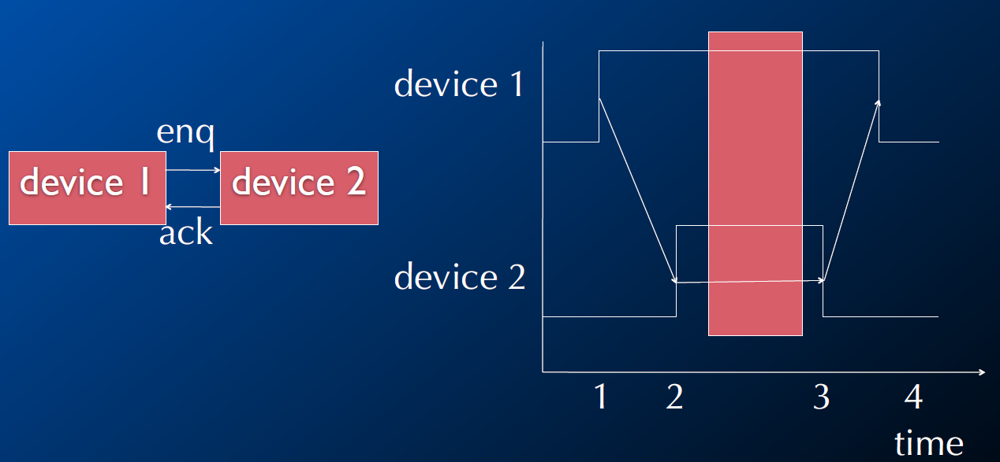

1. 设备1引发enq。
2. 设备2以ack响应。
3. 完成后，设备2降低确认。
4. 设备1降低enq。

## 3.4. 微处理器总线
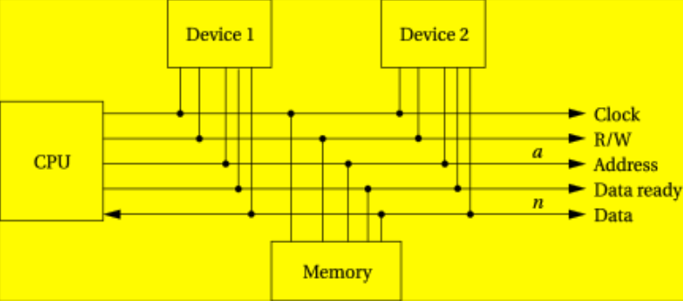

1. 时钟提供同步。
2. 读时R / W为true(读时R / W’为false)。
3. 地址是地址线的位捆绑。
4. 数据是n位数据线束。
5. 当n bit数据就绪时，数据就绪信号发出。

## 3.5. 总线复用


## 3.6. 系统总线配置
1. 多个总线允许并行处理：
   1. 一条总线上的设备慢。
   2. 快速设备位于单独的总线上。
2. 桥连接两条总线。
3. PC端类似，使用南桥和北桥来完成，北桥连接CPU

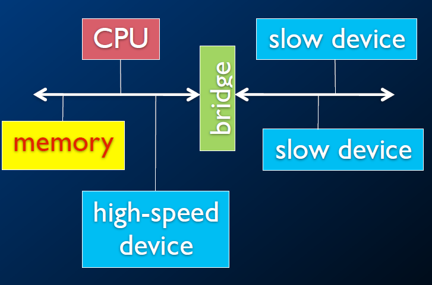

## 3.7. 桥状态图


## 3.8. ARM AMBA bus
1. 两个类别:
   1. AHB是高性能的。
   2. APB是低速，低成本的。
2. AHB支持流水线，突发传输，拆分事务，多个总线主控。
   1. H:高速
3. 所有设备都是APB上的从设备。
   1. APB是外部

|                      |                      |
| -------------------- | -------------------- |
|  | 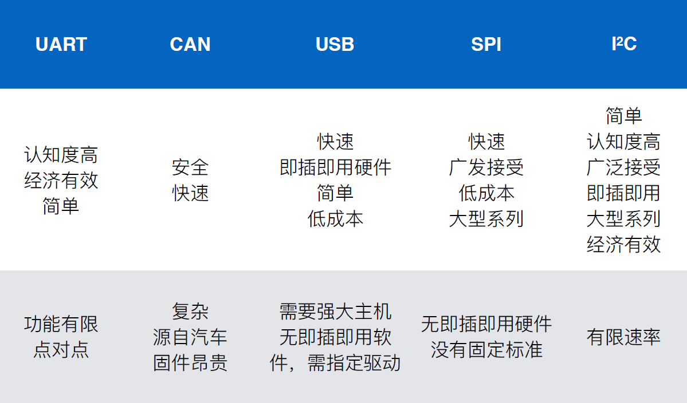 |

- $USB3.0$是高速设备
- $SPI$和$I^2C$也是非常多的
  - $SPI$:点对点星型设备
  - $I^2C$:串行设备
  - 开源硬件一般同时支持这两个
- 市面上的开源硬件支持$USB$、$SPI$和$I^2C$

## 3.9. Arduino Uno R3

|                      |                      |
| -------------------- | -------------------- |
|  | 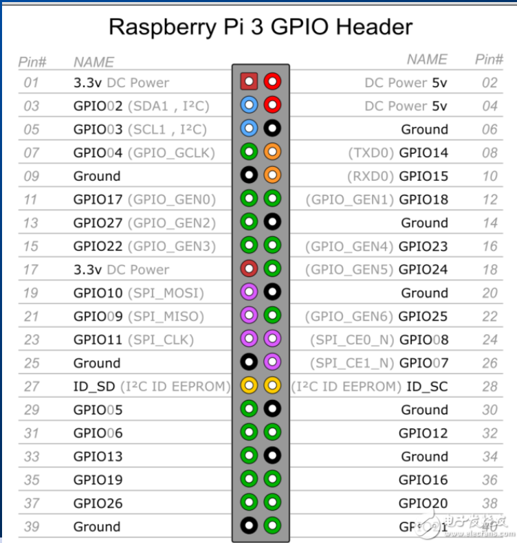 |
