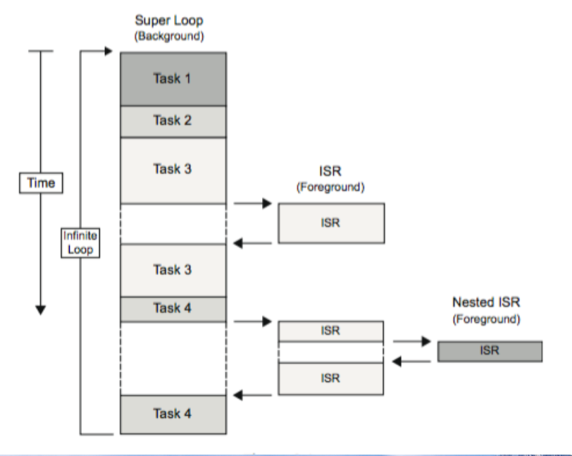

lec06-Embedded Software System
---

# 1. 嵌入式软件概述

## 1.1. 嵌入式软件开发路线图
1. 系统越来越复杂，嵌⼊式系统的软件开发逐渐变成了软件专家的工作
2. 对电⼦硬件很了解，也愿意做⼀些和硬件密切相关的工作。
3. 最近10-15年，伴随着嵌⼊式软件规模和复杂性的爆炸性增⻓，专门的软件开发团队进⼊了视野。软件团队在不断壮大，但这种增长不仅仅是因为完成所需的代码。嵌⼊式软件团队中有不同领域的专家，包括⽹络、⽤户界⾯设计、硬件设备、传统嵌⼊式软件设计等方面。

## 1.2. 嵌入式软件与桌面软件的对比

### 1.2.1. 内存
1. 有限，影响编程语言的选择以及开发工具的使用（⽐如编译器优化）

### 1.2.2. CPU处理能力
1. 成本和功耗的考虑，ES不得不采用保守的设计⽅案，其中的CPU往往只是恰好满足要求。

### 1.2.3. 操作系统
1. OS（Windows/Linux）、RTOS、专有OS或裸机

### 1.2.4. 实时行为
1. 实时系统不⼀定会运行得很快，但⼀定是可预测的—通常的术语叫做确定性
2. 实时性的要求对于OS的选择和程序设计都有影响

### 1.2.5. 开发流程
1. ES往往没有足够的资源进行软件开发。交叉开发对于工具的选择有很⼤影响。
2. 开发过程也不同，编辑/编译/调试的循环是一样的，但执⾏程序这⼀步却⾮常复杂，需要把代码转移到⽬标机上或者在某种环境下运⾏。

### 1.2.6. 执行流程
1. 多数嵌入式设备从开机开始就会运行某个程序，该程序会⼀直运⾏到系统关机。这个程序可能存储在ROM，也可能是从⾮易失性存储器转移到RAM中执⾏。

### 1.2.7. 每一个嵌入式设备都是不同的
1. 可能是技术层⾯的：不同的CPU架构、内存、外设、应⽤程序和操作系统
2. 也可能是商业运作层⾯的，⽐如⼿机开发、⽣产的商业模式就和核磁共振扫描仪完全不同。

### 1.2.8. 嵌⼊式软件工具和组件
1. 与桌⾯软就开发⼀样，嵌⼊式软件⼯程师需要运⽤⼯具来构建和测试软件。同时，也很可能会引⼊可重⽤的软件组件

### 1.2.9. 开发工具
1. 从表⾯上看，嵌⼊式软件的开发过程和桌⾯软件很像：编译代码模块，然后在调试器的控制下执⾏。然⽽，并不这么简单，有着显著的不同。
2. 交叉编译器
3. 有时候嵌⼊式应⽤中会直接包含⼩部分的汇编代码
4. 嵌⼊式链接器除了将多个对象模块和函数库例程整合在⼀起以外，链接器还负责在内存中正确定位代码和数据。嵌⼊式系统的内存映射⼗分复杂，对于精确性的要求也⼗分严格。链接器必需能够灵活地应对这些要求。
5. 嵌⼊式调试器并不是⼀个单⼀的组件，⽽是⼀系列对应不同运⾏环境的⼯具。借由在本地或者指令集模拟器中运⾏代码，代码可以仅在宿主机上运⾏。调试器也可以和⼀个⽬标板相连接（JTAG或其他⽅式，如以太⽹），并执⾏代码。
6. 其他⼀些更有针对性的⼯具，典型的选项包括分析实时性能、代码执⾏时设备功耗情况的分析器。

### 1.2.10. 软件组件
1. 最简单和显⽽易⻅的可重⽤的软件组件是库。⼀些库是由编译器提供的，嵌⼊式编译器提供的库应当是适合嵌⼊式环境的：可以重⼊、可以被存储在ROM中。(不会使用printf:会有问题)
2. 其他可⽤的库，特别是针对C++的库，如标准模板库STL。这些库可能并不适合嵌⼊式应⽤，在使⽤时要多加⼩⼼。
3. 与硬件交互式难点之⼀。在OS内部设备驱动提供了这样的接⼝
4. ES的互联性不断提⾼，需要不同的⽹络⽀持，TCP/IP或总线CAN\I2C，其他⽹络技术SNMP、Zigbee、Bluetooth、WiFi和USB。最重要的是应该检查有效性，确保符合标准，并能和其他系统互通互联。
5. 嵌⼊式设备对于有组织的数据存储是有需求的，⽐如能够应对电源故障和⽀持多线程。
6. LCD（往往是触摸式的）成本减低让其能够被应⽤到嵌⼊式设计中。软件于是迎来了⼀项挑战：⽀持复杂的图像和⽤户界⾯。

# 2. 软件如何影响硬件设计

## 2.1. 谁设计硬件？
1. 可能有同时负责软件和硬件的嵌入式工程师
2. 更有可能拥有两个团队：少数掌握这两个知识的工程师
3. 有关硬件的决定可能会对软件产生持久影响

## 2.2. 软件/硬件的权衡
1. 微处理器选择：可能会影响软件效率
2. 内存大小和混合
   1. 延迟承诺是可取的
   2. ROM/RAM互换性很有用
3. 外围设备实现：有时可通过软件替换[例如 计时器]

## 2.3. 调试硬件
1. 在线仿真器：不广泛使用，
2. 监控调试器
   1. 需要沟通渠道，额外的性能消耗
   2. 需要RAM/ROM交换
3. 片上调试
   1. 需要板载连接器，相当于协议转换器
   2. 需要RAM/ROM交换

## 2.4. 自检支持
1. I/O电路：“回送”可能有用
2. 板载开关：适用于配置或模式选择
3. 状态显示:提供对用户额外的信息
   1. 可能是字符或只是LED
   2. LED至少可以具有3种状态：开，关，闪烁

# 3. 嵌入式系统软件架构

## 3.1. 软件分层


## 3.2. 嵌入式系统的可视化程序模型
1. 实时系统有两种基本的程序模型
   1. 将实时应用视为单个执⾏线程
   2. 将实时应用视为多个执⾏线程
2. 取决于需要构建什么类型的系统

## 3.3. 为何要为实时系统建立模型
1. 辅助测试和完善最终系统
2. 更重要的是，模型利⽤它所知的系统属性来描述整个系统，并能够被⽤于对系统特性的进⼀步研究
3. 实时⼯程师使⽤程序模型来开发软件和硬件，以便能将整个实时系统全盘考虑
4. 模型使得⼯程师能够预测程序的运⾏，从⽽满⾜系统的性能需求和功能需求

## 3.4. 模型间的差异
1. ⼀些模型易于编写，但调试不易
2. 难于编写，但调试容易
3. ⼀些模型使得程序运⾏得更快，但需要付出更多内存资源消耗的代价
4. ⼀些鲁棒性更好，但维护很简单的模型

### 3.4.1. 单线程程序模型优缺点
1. 优点
   1. 编程和再编程⾮常快速简单
   2. 改变系统响应的特性的同时，往模型上添加新功能插件也相当容易
2. 缺点
   1. 在于应⽤领域的限制
   2. 难以做到安全地再编程
   3. 很难应⽤到不同⾏为或不同环境的运⾏系统中去。

### 3.4.2. 多线程程序模型的优缺点
1. 优点
   1. 允许将系统⼯作划分为⼏个逻辑阶段，然后编写相互独⽴的程序来处理各⾃的⼯作。
   2. 所有处理过程并⾏。
   3. 如果有更⾼吞吐量的需求，⼯程师可以在任务中引⼊新的通信和协作模型
2. 缺点:可能引⼊资源竞争

## 3.5. 嵌入式软件体系结构概述
1. 轮询
2. 有限状态机
3. 带中断的轮询
4. 仅有中断
5. 功能队列调度
6. 实时操作系统（RTOS）

### 3.5.1. 轮询
```c++
//Round Robin / Control Loop
//Everything is a function call from the main loop
void main(void) {
   while(TRUE) {
      if (device_A requires service)
         service device_A
      if (device_B requires service)
         service device_B
      if (device_C requires service)
         service device_C
      ... and so on until all devices have been serviced, then start over again
   }
}
```

- 可确定性:如果有任务不能确定时间，会导致其他所有的任务都被影响到。而这不符合嵌入式的实时性要求。
- 循环赛的特点:
  - 优先级:无，一切按顺序进行。
  - 响应时间:所有任务的总和。
  - 变更的影响:重大。改变执行任务时间或添加任务会影响所有其他任务。
  - 简单，没有共享数据问题。


- 例子:Arduino - 按下按钮时打开LED
```c++
const int LED = 13; // the pin for the LED
const int BUTTON = 7; // the input pin where the
// pushbutton is connected
int val = 0; // val will be used to store the state
// of the input pin
void setup() {
   pinMode(LED, OUTPUT); // tell Arduino LED is an output
   pinMode(BUTTON, INPUT); // and BUTTON is an input
}
void loop(){
   val = digitalRead(BUTTON); // read input value and store
   it
   // check whether the input is HIGH (button pressed)
   if (val == HIGH) {
      digitalWrite(LED, HIGH); // turn LED ON
   }else{
      digitalWrite(LED, LOW);
   }
}
```

- Arduino - Watchdog
```c++
#include <avr/wdt.h>
#define TIMEOUT WDTO_8S // predefine time, refer avr/wdt.h
const int ledPin = 13; // the number of the LED pin

void setup(){
   // disable the watchdog
   //wdt_disable();
   pinMode(ledPin,OUTPUT);
   // LED light once after start or if timeout
   digitalWrite(ledPin,HIGH);
   delay(1000);
   // enable the watchdog
   wdt_enable(TIMEOUT);
}
void loop(){
   // process runing
   digitalWrite(ledPin,LOW);
   delay(9000); //if timeout trig the reset
   //feed dog
   wdt_reset();
}
```

### 3.5.2. 有限状态机
```c++
while(1) {
   switch(state) {
      case IDLE:
         check_buttons();
         LEDisplay_hex(NUM1);
         if (BUTTON1 | BUTTON2 | BUTTON3)
            state=SHOW;
         break;
      case SHOW:
         NUM1=0;
         if (BUTTON1) NUM1 += 0x0001;
         if (BUTTON2) NUM1 += 0x0010;
         if (BUTTON3) NUM1 += 0x0100;
         state=IDLE;
         break;
   }
}
```

- 与轮询类似，但只有当前状态被执行.
- 每个状态决定下一个状态（非顺序执行）。
- 优先级:每个状态确定下一个状态的优先级。
- 响应时间:所有任务的总和。
- 变更的影响:重大。更改任务的执行时间或添加任务会影响所有其他任务。
- 简单性:没有共享数据问题。

### 3.5.3. 带有中断的轮询
```c++
BOOL flag_A = FALSE; /* Flag for device_A follow-up processing */
/* Interrupt Service Routine for high priority device_A */
ISR_A(void) {
   ... handle urgent requirements for device_A in the ISR,
   then set flag for follow-up processing in the main loop ...
   flag_A = TRUE;
}
void main(void) {
   while(TRUE) {
      if (flag_A)
         //中断任务优先
         flag_A = FALSE
         //... do follow-up processing with data from device_A
      if (device_B requires service)
         service device_B
      if (device_C requires service)
         service device_C
      //... and so on until all high and low priority devices have been serviced
   }
}
```



- 优先级-中断优先于主循环:优先中断
- 响应时间
  - 所有任务的总和或
  - 中断执行时间
- 更改的影响-对于中断服务程序而言意义不大。 与循环作为主循环相同。
- 共享数据-必须处理与中断服务程序共享的数据
- MCU中使用最多的

### 3.5.4. 仅有中断
```c++
SET_VECTOR(P3AD, button_isr);
SET_VECTOR(TIMER1, display_isr);
while(1) {
;
}
```

- 如果ISR过多，可能会有问题
- 如果高优先级的中断执行所需的时间比低优先级的中断所需的时间长，那么某些中断将被错过。
- 或者您需要处理嵌套中断。
- 优先级-中断优先
- 响应时间:中断执行时间
- 变化的影响-对于中断服务程序而言意义不大。
- 共享数据-必须处理与中断服务程序共享的数据

### 3.5.5. 功能队列调度
1. 函数指针被添加到队列中。
2. 主循环在队列中循环并执行任务。
3. 任务或中断将新任务添加到功能队列中。
4. 最坏的时机

```c++
#define MAX_TASKS 20
typedef int(*FuncPtr)();
FuncPtr tasks[MAX_TASKS]
int current_task = 0;
void add_task(FuncPtr func) {
   int n;
   for(n=current_task+1;n<MAX_TASKS-1;n++) {
      if(tasks[n]==NULL) {
         tasks[n]=func;
         return;
      }
   }
   for(n=0;n<current_task;n++) {
      if(tasks[n]==NULL) {
         tasks[n]=func;
         return;
   }
}

id display_task() {
   LEDisplay_hex(NUM1);
   add_task(button_task);
}
void button_task() {
   check_buttons();
   NUM1=0;
   if (BUTTON1) NUM1 += 0x0001;
   if (BUTTON2) NUM1 += 0x0010;
   if (BUTTON3) NUM1 += 0x0100;
   add_task(display_task);
}

main() {
   LEDisplay_init();
   LEDisplay_clear();
   init_buttons();

   add_task(button_task);

   while(1) {
      if(tasks[current_task]==NULL) {
      ;
      }
      else {
         (*tasks[current_task])();
         tasks[current_task]=NULL;
      }
      current_task++;
      if(current_task>=MAX_TASKS) current_task=0;
   }
}
```

- 优先级-中断优先。任务按顺序执行
- 响应时间-最长任务的执行时间
- 变更的影响-低。中断管理优先级功能。队列管理较低的优先级。
- 共享数据-必须处理与中断服务程序共享的数据

#### 3.5.5.1. 函数队列优化
- 添加时间队列

```c++
typedef int(*FuncPtr);

typedef struct {
long timer;
int status;
FuncPtr;
} Task;

Task task_list[MAX_TASKS];
```

- 添加任务优先级

```c++
typedef int(*FuncPtr);

typedef struct {
int priority;
FuncPtr;
} Task;

Task task_list[MAX_TASKS];
```

### 3.5.6. 抢占式多任务或多线程
1. 在这种类型的系统中，低级代码段基于计时器（连接到中断）在任务或线程之间切换。这是通常认为系统具有“操作系统”内核的级别。 根据所需的功能量，它或多或少地引入了管理在概念上并行运行的多个任务的复杂性。
2. 要访问共享数据，必须通过某种同步策略来控制，例如消息队列，信号量或非阻塞同步方案。
3. 由于这些复杂性，组织通常使用实时操作系统（RTOS），从而使应用程序程序员可以专注于设备功能而不是操作系统服务。

### 3.5.7. RTOS见后

## 3.6. 内核分类

### 3.6.1. 实时内核


### 3.6.2. 微内核
1. 微内核是从实时操作系统升级的逻辑选择，通常的安排是操作系统内核分配内存并将CPU切换到不同的执行线程。 用户模式进程实现主要功能，例如文件系统，网络接口等。
2. 通常，微内核在任务切换和任务间通信快速时成功，而在速度慢时失败。

### 3.6.3. 单内核
1. 具有复杂功能的相对较大的内核适用于嵌入式环境。
2. 示例：嵌入式Linux和Windows CE
3. 尽管硬件成本增加，但这种嵌入式系统却越来越受欢迎，尤其是在功能更强大的嵌入式设备（例如无线路由器和GPS导航系统）上。原因如下：
   1. 提供了通用嵌入式芯片组的端口。
   2. 它们允许将公共可用代码重复用于设备驱动程序，Web服务器，防火墙和其他代码。
   3. 开发系统可以从广泛的功能集开始，然后可以将该发行版配置为排除不需要的功能，并节省其消耗的内存开销。
   4. 许多工程师认为，在用户模式下运行应用程序代码更可靠且更容易调试，从而使开发过程更容易且代码更可移植。
   5. 需要更快响应且可以保证的功能通常可以放置在硬件中。

# 4. Real time operating systems (RTOS) 实时操作系统

## 4.1. 整体操作系统模型(和Linux相似)


## 4.2. 操作系统
1. 操作系统控制资源：
   1. 谁获得CPU；
   2. I / O何时发生；
   3. 分配了多少内存。
   4. 流程如何通信。
2. 最重要的资源是CPU本身：由调度程序控制的CPU访问。

## 4.3. RTOS and GPOS
1. 相似的功能
   1. 多任务级别
   2. 软件和硬件资源管理
   3. 为应用提供基本的OS服务
   4. 从软件应用抽象硬件

## 4.4. RTOS从GPOS中分离出来的不同功能
1. 嵌入式应用上下文中具有的更好的可靠性
2. 满足应用需要的裁剪能力
3. 更快的特性
4. 减少内存需求
5. 为实时嵌入式系统提供可裁剪的调度策略
6. 支持无盘化嵌入式系统，允许从ROM或RAM上引导并运行
7. 对不同硬件平台具有更好的可移植性。

## 4.5. Commercial RTOSs (partial)


## 4.6. Real-time Operating System (RTOS)，实时操作系统
1. 为什么要实现实时操作系统？
   1. 灵活性
   2. 响应时间


### 4.6.1. 基本单位
1. 实时操作系统的基本组成部分是进程。
2. 由于没有主循环，因此可以轻松添加新进程或删除过时的进程。
3. RTOS根据进程的优先级安排运行时间。

### 4.6.2. 调度程序
1. RTOS的调度程序用来跟踪每个进程的状态，并确定应该运行的进程。
2. 调度基本单位是进程，调度是通过有限状态机完成的

## 4.7. 时序约束
1. 执行计算以符合外部时序约束。
2. 截止时间频率
  - 周期性
  - 非周期性的
3. 截止时间类型：
  - 硬性：未能按时完成会导致系统故障
  - 软性：未按时完成进程会导致响应降低
- 偶发进程:具有一定时钟周期的进程

### 4.7.1. 进程时序的规范
1. 释放时间:进程处于就绪态的时间
2. 截止时间:进程必须结束的时间

### 4.7.2. 释放时间和截止时间


- 非周期性的进程
- 紫色表示占用CPU的时间，紫色右侧是结束时间


- 周期性进程
- 截止时间默认和周期时间相同


- 周期性性进程
- 比较复杂，时序的截止时间小于其周期性

## 4.8. 进程速率要求
- 周期：进程激活之间的间隔。
- 速率：周期的倒数。
- 启动速率可能高于周期:一次运行多个副本。


## 4.9. 时间冲突
- 如果流程没有在截止时间之前完成，会发生什么？
  - 硬截止时间：如果错过了系统就会失败。
  - 软截止时间：用户可能会注意到，但系统不一定会出现故障。
- 我们希望通过自己的调度算法来尽可能避免这种问题

## 4.10. 示例：航天飞机软件错误
> 航天飞机的首次发射由于软件计时错误而延迟：
1. 主控制系统PASS和备用系统BFS。
2. BFS无法与PASS同步。
3. 更改为一个例行增加的延迟，这会延迟开始时间的计算。
4. 67机会问题中的1。

## 4.11. 进程执行特征
1. 进程执行时间 $T_i$
   - 没有抢占的执行时间。
   - 可能的时间单位：秒、时钟周期
   - 在某些情况下，最坏、最好情况的执行时间可能会有用。
2. 变化来源：
   - 数据依赖性。
   - 内存系统。
   - CPU管道。
3. 主备冗余、多机热备

## 4.12. 利用率
1. CPU利用率
  1. CPU执行有用的工作的比率
  2. 通常在没有调度开销的情况下进行计算

$$
U = \frac{CPU\ time\ for\ userful\ work}{total\ available\ CPU\ time} \\
\ \\
= \frac{\sum\limits_{t_1\leq t \leq t_2}T(t)}{t_2 - t_2} \\
\ \\
= \frac{T}{t}
$$

## 4.13. 过程状态
> 流程可以处于以下三种状态之一：
1. 在CPU上执行；
2. 准备执行
3. 等待数据。


## 4.14. 调度问题
1. 我们可以在所有截止日期之前完成吗？在所有情况下都必须能够按时完成进程。
2. 我们需要多少个CPU才能按时完成进程？

### 4.14.1. 嵌入式与通用调度
1. 调度工作尝试避免使CPU访问过程变得空闲：公平=访问CPU。
2. 嵌入式系统必须符合所有截止时间:低优先级进程可能不会长时间运行。

### 4.14.2. 操作系统进程管理
1. 操作系统需要跟踪：
   1. 流程优先级
   2. 时序状态
   3. 进程激活记录
2. 可以创建进程：
   1. 系统启动前静态；
   2. 在执行期间动态：比如电话

### 4.14.3. 多道程序操作系统


- 进程:程序的唯一执行者
  - 代码 + 数据
  - 多进程可能会共享代码
  - 每一个进程都会有唯一的数据(CPU寄存器，栈空间、内存空间)
  - 进程会被他们的激活记录定义


- 线程有他们自己CPU寄存器值，但是共享相同的内存空间，所以他们可以通过其他线程来影响数据
  - 一个进程可能有不同的线程
  - 线程可能会运行在划分出来的CPU核心栈上

### 4.14.4. 典型的进程/任务激活记录（任务控制块）
- 任务ID
- 任务状态（运行，就绪，已阻止）
- 任务优先级
- 任务起始地址
- 任务堆栈
- 任务CPU寄存器
- 任务数据指针
- 任务时间（滴答声）

### 4.14.5. 什么时候可以分派新线程？
1. 在非抢占式调度中：当前线程完成时可以分派新线程
2. 在抢先式调度下：
   1. 在计时器中断时
   2. 在I/O中断时可能会分派新县城
   3. 创建新线程或完成一个新线程时
   4. 当前线程阻塞或释放互斥锁时
   5. 当前线程阻塞信号量时
   6. 更改信号量状态时
   7. 当前线程进行任何OS调用时
      1. 文件系统访问
      2. 网络访问
      3. ...

### 4.14.6. 当前的焦点：如何决定要安排哪个线程？
- 需要关注的内容有
  - 抢先式与非抢先式调度
  - 定期与非定期任务
  - 固定优先级与动态优先级
  - 优先反转异常
  - 其他计划异常

### 4.14.7. 指标（我们如何评估调度策略）
1. 能够满足所有截止时间。
2. CPU利用率-有效工作的时间百分比。
3. 计划开销:制定计划所需的时间。
4. 延迟
5. 总完成时间。

## 4.15. 抢占式调度
- 假设所有线程都有优先级
  - 静态分配的（在线程持续时间内恒定）
  - 动态分配的（可能有所不同）
- 进一步假设内核跟踪“启用”了哪些线程（能够执行，例如在等待信号量或互斥量或时间到期之前不会被阻塞）。
- 抢占式调度：
  - 在任何时候，具有最高优先级的已启用线程正在执行。
  - 每当任何线程更改优先级或启用状态时，内核都可以分派新线程。

## 4.16. 速率单调调度(RMS, Rate Monotonic Scheduling)
- 假设使用以下命令定期调用n个任务：
  - 周期T1，...，Tn（施加实时约束）
  - 所有任务都是独立的。
  - 最坏情况执行时间（WCET）C1，...，Cn：假定没有互斥请锁、信号量或阻塞的I/O
  - 没有优先级限制
  - 固定优先级
  - 上下文切换所需的时间可以忽略不计
  - 抢占式调度
- 定理：如果任何优先级分配产生可行的时间表，则按时段排序的优先级（最小时段具有最高优先级）也产生可行的时间表。
- 就可行性而言，RMS是最佳的。
- Liu和Leland，“在硬实时环境中调度多程序的算法”，J。ACM，20（1），1973年。

### 4.16.1. RMS的灵活性
- 为RMS定义的可行性是指每个任务在其指定时间内执行一次完成。

### 4.16.2. 显示RMS的优越性：考虑两个不同周期的任务

| 非抢占式时序是否可行？                               | 非抢占式的时间表是不可行的。红色任务的某些实例(2)如果我们进行非抢占式调度，则不会在其期限内完成。 |
| ---------------------------------------------------- | ------------------------------------------------------------------------------------------------- |
|                                  |                                                                               |
| 如果我们对红色任务有优先级更高的抢占式调度该怎么办？ | 具有较高优先级的红色任务的抢占式调度是可行的。请注意，抢占蓝色任务会延长其完成时间。              |
|                                  |                                                                               |

### 4.16.3. 显示RMS的优越性：任务调整
- 当低优先级任务的开始阶段与高优先级任务的开始阶段匹配时，其完成时间最差。
- 因此，在检查计划的可行性时，仅考虑最坏的情况就足够了：所有任务都同时开始其周期，如下就是最差情况


### 4.16.4. 显示RMS的优越：用于两个任务
- 足以表明，如果非RMS计划是可行的，则RMS计划是可行的。
- 考虑以下两个任务：


- 非RMS固定优先级时间表如下所示：我们可以观察到对于非RMS时序如果可行当且仅当$C_1 + C_2 \leq T_2$


- RMS时间表如下所示：周期较短的任务会提前移动，而对于RMS是可行的


### 4.16.5. 总结
- 该证明可以扩展到任意数量的任务（尽管它变得更加乏味）。
- 该证明仅具有最优性、可行性。它没有说其他最优标准。
- 实际实施：
  - 定时器中断在周期的最大公约数
  - 多个计时器

### 4.16.6. RMS的可行性调度分析
- 可调度性分析：如果需要，可以使用RM调度一组定期任务

$\sum\limits^n\limits_{i=1} \leq n(2^{\frac{1}{n} - 1)$

- 此条件足够，但不是必需的。
- $U = \sum\limits_{i=1}^{n}\frac{C_i}{T_i}$，表示处理器利用率因子U，它是执行任务集所花费的处理器时间的一部分。


## 4.17. DDL驱动时序

### 4.17.1. Jackson’s Algorithm: EDD (1955)
1. 给定n个具有期限d1，...，dn的独立一次性任务，对它们进行调度以最大程度地减少最大延迟，定义为

$L_{max} = \max\limits_{1 \leq i \leq n}\{f_i - d_i\}$

2. 其中$f_i$是任务i的完成时间。请注意，如果所有截止日期都得到满足，则这是负面的。
3. 最早到期日期（EDD,Earliest Due Date）算法：按不递减的截止日期顺序执行它们。
4. 请注意，这不需要抢占。

#### 4.17.1.1. 定理
> 从最大延迟的意义上讲，EDD是最佳的

1. 为了证明这一点，请使用互换参数。如果给定的时间表S不是EDD，则必须存在任务a和b，其中时间表中a紧接在b之前，但$d_a$>$d_b$。为什么？
2. 我们可以证明通过交换a和b可以改善此计划。因此，没有任何一个非EDD时间表可以达到比EDD更小的最大延迟，因此EDD时间表必须是最佳的。

#### 4.17.1.2. 考虑一个非EDD时序S
1. 在计划中必须存在任务a和b，其中a紧接在b之前，但$d_a$>$d_b$


2. 所以S'绝对不会比S的情况更差

### 4.17.2. Horn的算法：EDF（1974）
1. 通过允许任务随时“到达”（准备就绪）来扩展EDD。
2. 最早截止时间优先（EDF）：给定n个独立任务的集合，它们具有任意的到达时间，任何算法在任何到达的任务中以绝对绝对最早的时间最早执行任务的任何算法都是最优的。最大程度地减少**延迟**。
3. 证明使用类似的互换参数。

#### 4.17.2.1. 使用EDF执行定期任务
- EDF算法可以被同等地应用于周期性任务和非周期性任务。
  - 最简单的用法：截止时间是该期限的结束。
  - 替代用途：分别指定时间（相对于期间开始时间）和期限。

#### 4.17.2.2. RMS和EDF哪个好
1. RMS优点:调度决策更简单（固定优先级与EDF所需的动态优先级。EDF调度程序必须维护按优先级排序的就绪任务列表。）
2. EDF优点:
   1. 由于EDF是关于最大延迟的最优，也是关于可行性的最优选择。 RMS仅是关于可行性的最优选择。对于不可行的计划，RMS会完全阻止优先级较低的任务，从而导致无限的最大延迟。
   2. 如果RMS无法做到这一点，那么EDF可以充分利用
   3. EDF实际上减少了抢占，因此减少了上下文切换的开销。
   4. 截止时间可能与周期不同。

## 4.18. 优先级约束
1. 有向无环图（DAG）显示优先级，这些优先级指示哪些任务必须在其他任务开始之前完成。
2. DAG，表明任务1必须在任务2和3开始之前完成，依此类推。


|  |  |
| -------------------- | -------------------- |
|  |  |
|  |  |
|  |  |


- $C_i$：进程时间
- $D_i$：表示截止时间