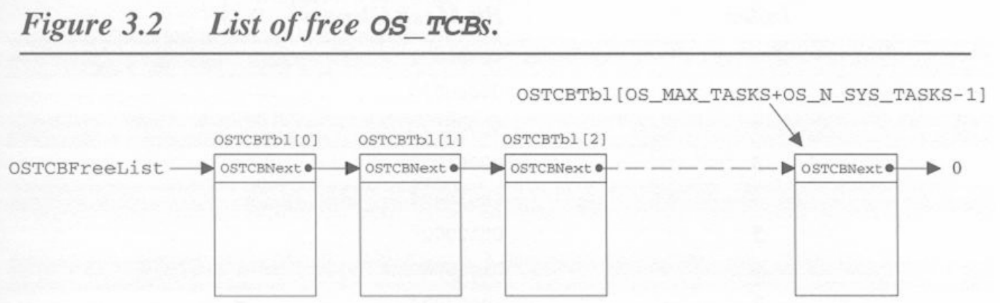
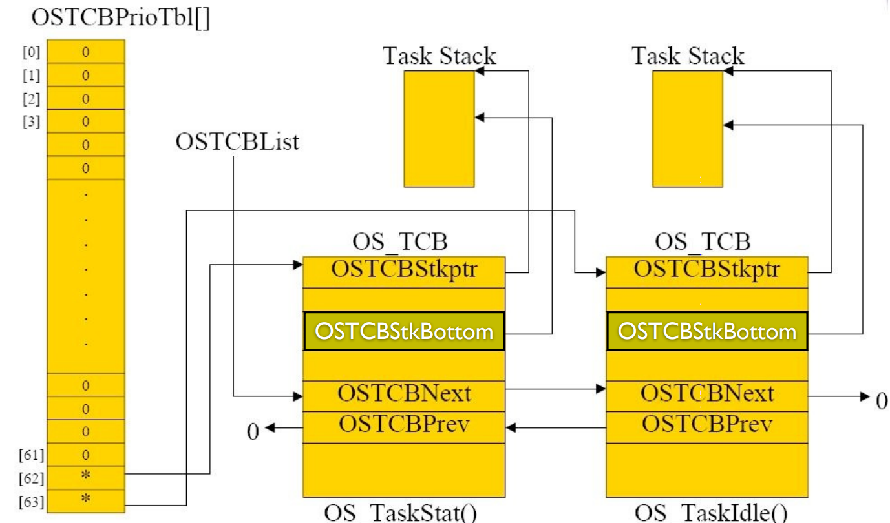
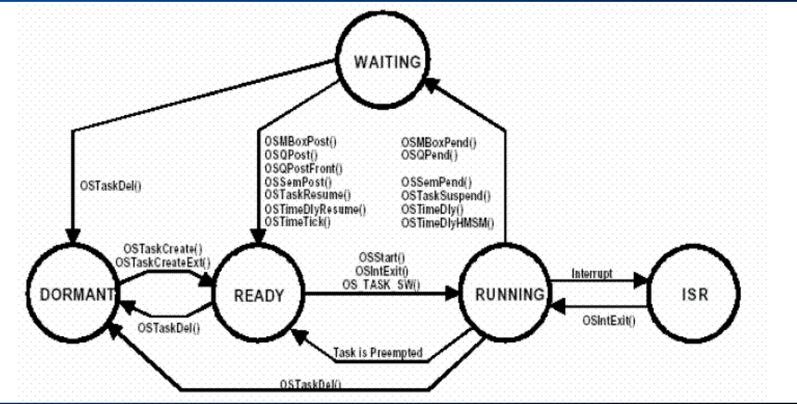
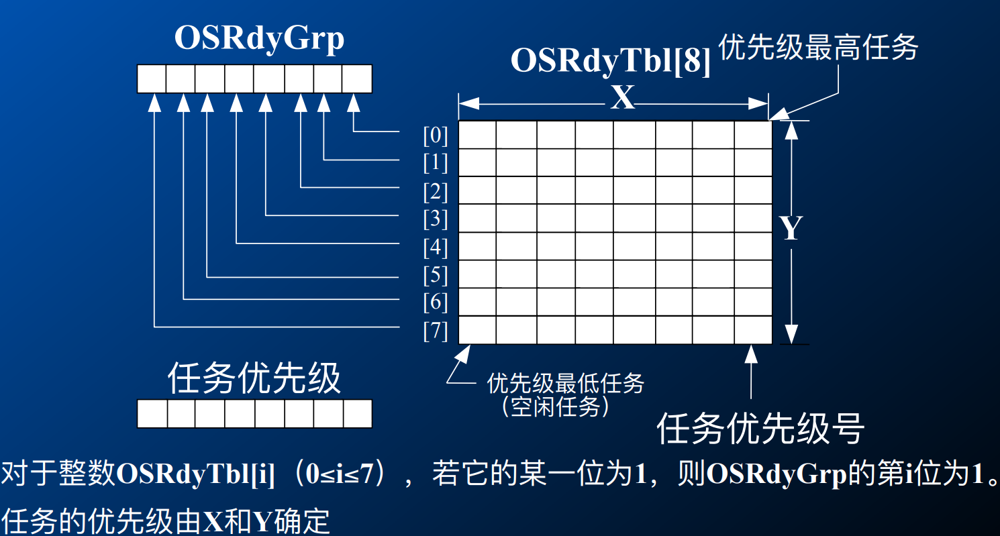
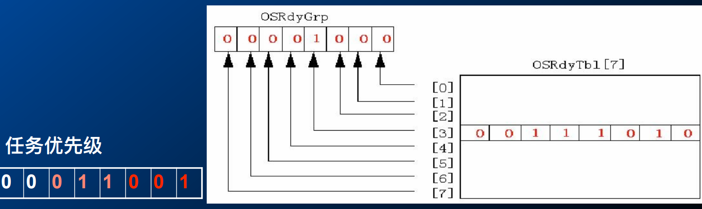
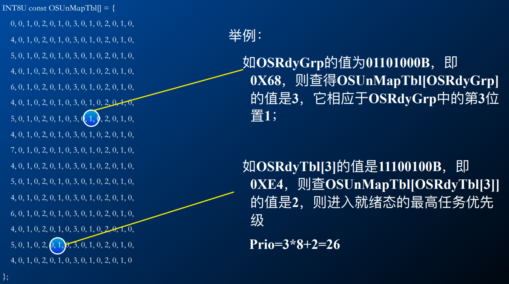
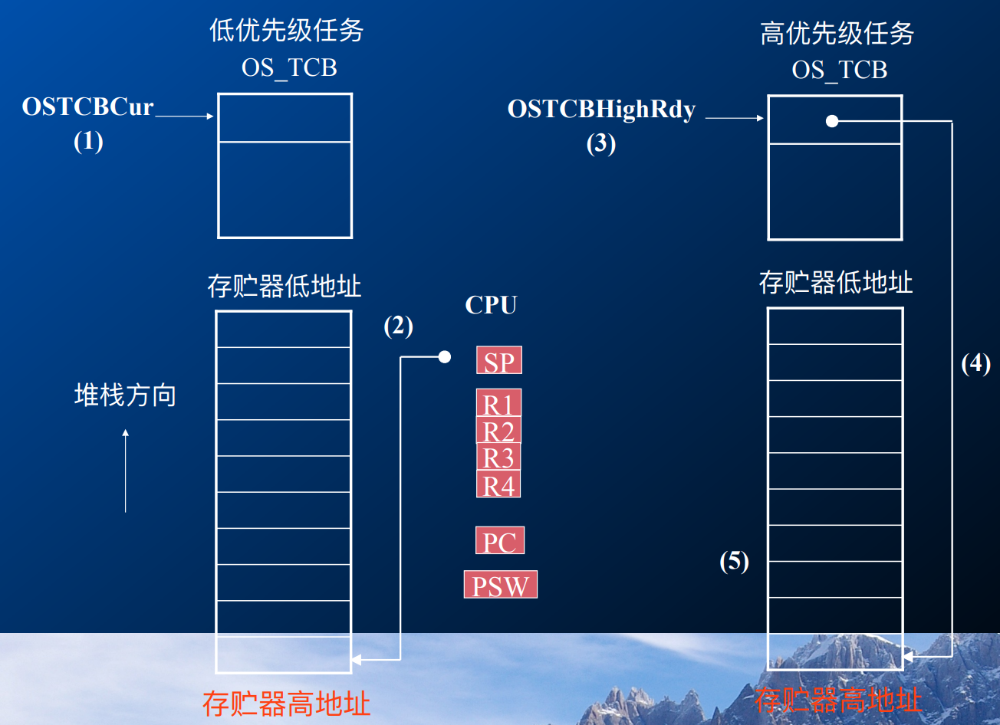
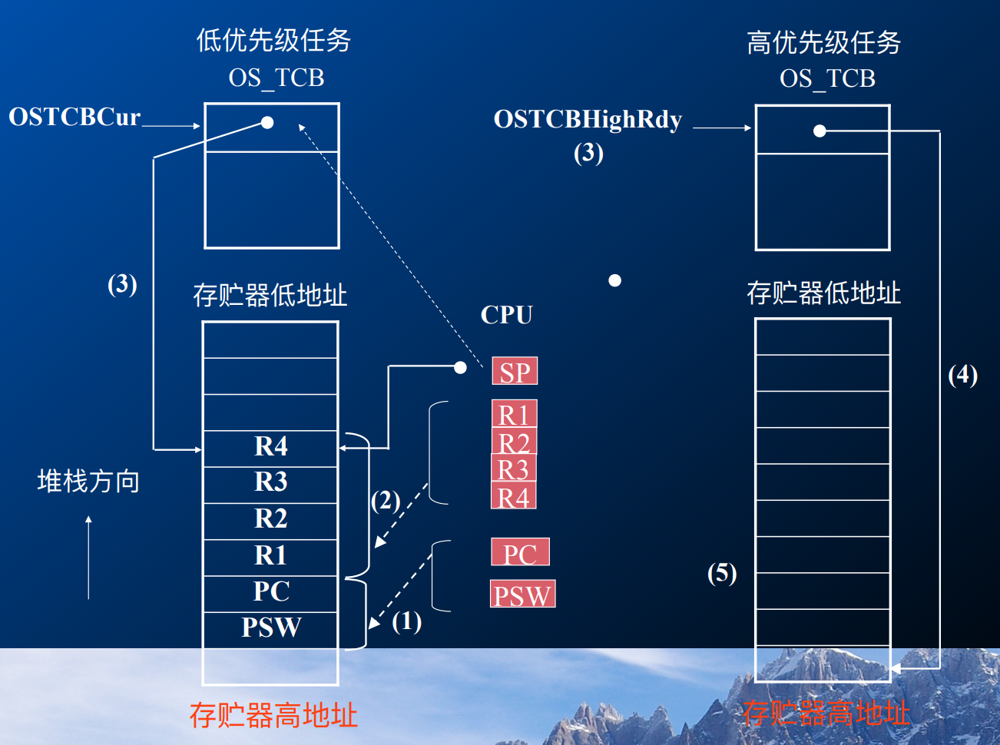
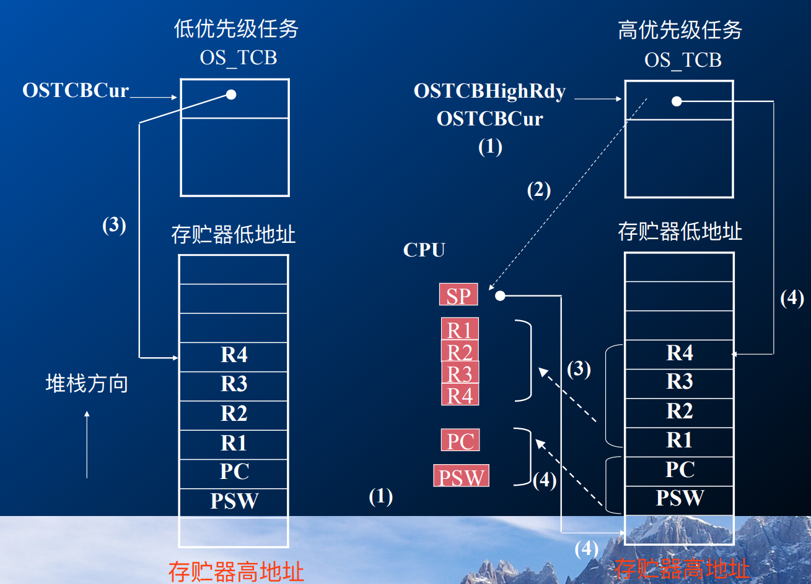

Lecture07-The Real-Time Kernel
---

# 1. 任务管理

## 1.1. 任务主函数
```c++
void YourTask (void *pdata) {
  for (;;) {
    /* USER CODE
    Call one of uC/OS-II's services:
    OSFlagPend();
    OSMboxPend();
    OSMutexPend();
    OSQPend();
    OSSemPend();
    OSTaskSuspend(OS_PRIO_SELF);
    OSTimeDly();
    OSTimeDlyHMSM();
    /* USER CODE */
  }
}
  // 或者是
void YourTask (void *pdata) {
  /* USER CODE */
  OSTaskDel(OS_PRIO_SELF);
}
```

- 开源代码用来学习是可以的，但是如果要商用，则需要获取到开源代码所有者的商业许可。

## 1.2. 任务优先级
1. μC/ OS-II最多可以管理64个任务
2. 尽管μC/ OS-II保留了四个最高优先级任务和四个最低优先级任务供自己使用。 但是，此时，μC/ OS-II实际上仅使用两个优先级：OSTaskCreate和OS_LOWEST_PRIO-1（请参阅OS_CFG.H）。这使您最多可以执行56个应用程序任务。
3. 优先级的值越小，任务的优先级越高。
4. 在当前版本的μC/ OS-II中，任务优先级编号也用作任务标识符。
5. 任务优先级一致怎么办：
   1. 时间片流转:先使用一定的时间片完成，然后将结果给下一个使用
   2. 先到先服务

## 1.3. 空闲任务和统计任务
1. 内核总是创建一个空闲任务OSTaskIdle()
   1. 总是设置为最低优先级，OS_LOWEST_PRIOR
   2. 当所有其他任务都未在执行时，空闲任务开始执行
   3. 应用程序不能删除该任务；
   4. 空闲任务的工作就是把32位计数器OSIdleCtr加1，该计数器被统计任务所使用；
2. 统计任务OSTaskStat()，提供运⾏时间统计。每秒钟运⾏一次，计算当前的CPU利⽤率。其优先级是OS_LOWEST_PRIOR-1，可选。

## 1.4. 任务控制块TCB
1. 任务控制块 OS_TCB是描述⼀个任务的核⼼数据结构，存放了它的各种管理信息，包括任务堆栈指针，任务的状态、优先级，任务链表指针等；
2. ⼀旦任务建⽴了，任务控制块OS_TCB将被赋值。

```c++
typedef struct os_tcb
{
  //栈指针；
  //INT16U OSTCBId; /*任务的ID*/
  //链表指针；
  //OS_EVENT *OSTCBEventPtr; /*事件指针*/
  //void *OSTCBMsg; /*消息指针*/
  //INT8U OSTCBStat; /*任务的状态*/
  //INT8U OSTCBPrio; /*任务的优先级*/
  //其他……
} OS_TCB;
```

## 1.5. 栈指针
1. OSTCBStkPtr：指向当前任务栈顶的指针，每个任务可以有⾃⼰的栈，栈的容量可以是任意的；
2. OSTCBStkBottom：指向任务栈底的指针；
3. OSTCBStkSize：栈的容量，⽤可容纳的指针数⽬⽽不是字节数（Byte）来表⽰。

## 1.6. 链表指针
1. 所有的任务控制块分属于两条不同的链表，单向的空闲链表（头指针为OSTCBFreeList）和双向的使⽤链表（头指针为OSTCBList）；
2. OSTCBNext、OSTCBPrev：⽤于将任务控制块插⼊到空闲链表或使⽤链表中。每个任务的任务控制块在任务创建的时候被链接到使⽤链表中，在任务删除的时候从链表中被删除。双向连接的链表使得任⼀成员都能快速插⼊或删除。

## 1.7. 空闲TCB链表
1. 所有的任务控制块都被放置在任务控制块列表数组OSTCBTbl[]中，系统初始化时，所有TCB被链接成空闲的单向链表，头指针为OSTCBFreeList。当创建⼀个任务后，就把OSTCBFreeList所指向的TCB赋给了该任务，并将它加⼊到使⽤链表中，然后把OSTCBFreeList指向空闲链表中的下⼀个结点。
2. 为什么空闲是单项链表，使用是双项链表？因为双向链表有利于将时间复杂度降低为常数。
   1. 遍历链表的时间复杂度是O(n)
   2. 期望遍历复杂度是O(1)，常数，开辟一个数据存放所有任务和TCB地址
   3. 用空间换时间



## 1.8. 指针数组(指向相应TCB)


## 1.9. 状态的转换


## 1.10. 任务就绪表
1. 每个任务的就绪态标志放⼊在就绪表中，就绪表中有两个变量OSRdyGrp和OSRdyTbl[]。
2. 在OSRdyGrp中，任务按优先级分组，8个任务为⼀组。OSRdyGrp中的每⼀位表⽰8组任务中每⼀组中是否有进⼊就绪态的任务。任务进⼊就绪态时，就绪表OSRdyTbl[]中的相应元素的相应位也置位。



- (0, 0)是优先级最高的任务，(7, 7)是优先级最低的

### 1.10.1. 根据优先级确定就绪表
1. 假设优先级为12(优先级为0)的任务进⼊就绪状态，12=1100b,则OSRdyTbl[1]的第4位置1，且OSRdyGrp的第1位置1，相应的数学表达式为: 
   1. `OSRdyGrp |= 0x02`
   2. `OSRdyTbl[1] |= 0x10`
2. ⽽优先级为21的任务就绪21=10 101b，则OSRdyTbl[2]的第5位置1，且OSRdyGrp的第2位置1,相应的数学表达式
   1. `OSRdyGrp |= 0x04`
   2. `OSRdyTbl[2] |= 0x20`
3. 从上⾯的计算可知: 若OSRdyGrp及OSRdyTbl[] 的第n位置1，则应该把OSRdyGrp及OSRdyTbl []的值与2n 相或。uC/OS中，把2n的n=0-7的8个值先计算好存在数组OSMapTbl[7]中,也就是：
   1. OSMapTbl[0] = $2^0$ = 0x01（0000 0001）
   2. OSMapTbl[1] = $2^1$ = 0x02（0000 0010）
   3. OSMapTbl[7] = $2^7$ = 0x80（1000 0000）
4. 如果prio是任务的优先级，即任务的标识号，则将任务放⼊就绪表，使任务进入就绪态的⽅法是：
   1. `OSRdyGrp |= OSMapTbl[prio>>3]`
   2. `OSRdyTbl[prio>>3] |= OSMapTbl[prio&0x07]`
5. 假设优先级为12:1100b
   1. `OSRdyGrp |= OSMapTbl[12>>3](0x02)`
   2. `OSRdyTbl[1] |= 0x10`

### 1.10.2. 使任务脱离就绪态
1. 将任务就绪表OSRdyTbl[prio>>3]相应元素的相应位清零，⽽且当OSRdyTbl[prio>>3]中的所有位都为零时，即该任务所在组的所有任务中没有⼀个进⼊就绪态时，OSRdyGrp的相应位才为零：`if((OSRdyTbl[prio>>3] &= ~OSMapTbl[prio&0x07]) == 0) OSRdyGrp &= ~OSMapTbl[prio>>3];`

## 1.11. 任务的调度
1. μC/OS-II是可抢占实时多任务内核，它总是运⾏就绪任务中优先级最⾼的那⼀个。
2. μC/OS-II中不⽀持时间⽚轮转法，每个任务的优先级要求不⼀样且是唯⼀的，所以任务调度的⼯作就是：查找准备就绪的最⾼优先级的任务并进⾏上下⽂切换。
3. μC/OS-II任务调度所花的时间为常数，与应⽤程序中建⽴的任务数⽆关。
4. 确定哪个任务的优先级最⾼，应该选择哪个任务去运⾏，这部分的⼯作是由调度器（Scheduler）来完成的。
   1. 任务级的调度是由函数OSSched()完成的；
   2. 中断级的调度是由另⼀个函数OSIntExt()完成的。

## 1.12. 根据就绪表确定最⾼优先级(为什么右移三维)
1. 两个关键:
   1. 将优先级数分解为⾼三位和低三位分别确定；
   2. ⾼优先级有着⼩的优先级号
2. 根据就绪表确定最高优先级
   1. 通过OSRdyGrp值确定⾼3位，假设OSRdyGrp＝0x08=0x00001000，第3位为1，优先级的⾼3位为011;
   2. 通过OSRdyTbl[3]的值来确定低3位，假设OSRdyTbl[3]＝0x3a，第1位为1，优先级的低3位为001，3*8+2-1=25



## 1.13. 任务调度器
```c++
void OSSched (void){
  INT8U y;
  OS_ENTER_CRITICAL();
  // 检查是否中断调⽤和允许任务调⽤
  if ((OSLockNesting | OSIntNesting) == 0) {
    y = OSUnMapTbl[OSRdyGrp];
    // 找到优先级最⾼的任务
    OSPrioHighRdy = (INT8U)((y << 3) + OSUnMapTbl[OSRdyTbl[y]]);
    // 该任务是否正在运行
    if (OSPrioHighRdy != OSPrioCur) {
      OSTCBHighRdy=OSTCBPrioTbl[OSPrioHighRdy];
      OSCtxSwCtr++;
      OS_TASK_SW();
    }
  }
  OS_EXIT_CRITICAL();
}
```

## 1.14. 源代码中使⽤了查表法
1. 查表法具有确定的时间，增加了系统的可预测性，uC/OS中所有的系统调⽤时间都是确定的
   1. `Y = OSUnMapTbl[OSRdyGrp]`
   2. `X = OSUnMapTbl[OSRdyTbl[Y]]`
   3. `Prio = (Y<<3) + X;`

## 1.15. 优先级判定表OSUnMapTbl[256]



- $2^8 = 256$:一共有256种情况，查表解释即可
- 空间换时间，用来快速查找当前优先级最高的部分

## 1.16. ->256
```c++
static void OS_SchedNew (void)
{
#if OS_LOWEST_PRIO <= 63//μC/OS-II v2.7之前⽅式
  INT8U y;
  y = OSUnMapTbl[OSRdyGrp];
  OSPrioHighRdy = (INT8U)((y << 3) + OSUnMapTbl[OSRdyTbl[y]]);
#else
  INT8U y;
  INT16U *ptbl;
  //OSRdyGrp为16位
  if ((OSRdyGrp & 0xFF) != 0) {
    y = OSUnMapTbl[OSRdyGrp & 0xFF];
  } else {
    y = OSUnMapTbl[(OSRdyGrp >> 8) & 0xFF] + 8;//矩形组号y>=8
  }
  ptbl = &OSRdyTbl[y];//取出x⽅向的16bit数据
  if ((*ptbl & 0xFF) != 0) {
    OSPrioHighRdy = (INT8U)((y << 4) + OSUnMapTbl[(*ptbl & 0xFF)]);//*16
  }
  else {
    OSPrioHighRdy = (INT8U)((y << 4) + OSUnMapTbl[(*ptbl >> 8) & 0xFF] + 8);
  }
#endif
}
```

- 未超过64位，则用上面的，如果超过了64位则使用下半部分
- 仔细分析一下:判定低八位是否为0，如果低八位不为0，则直接对低八位操作即可，如果低八位为0，则在高八位，所以需要加8

## 1.17. 任务切换
1. 将被挂起任务的寄存器内容⼊栈；
2. 将较⾼优先级任务的寄存器内容出栈，恢复到硬件寄存器中。

### 1.17.1. 任务级的任务切换OS_TASK_SW()
1. 保护当前任务的现场
2. 恢复新任务的现场
3. 执⾏中断返回指令
4. 开始执⾏新的任务

| 调用OS_TASK_SW()前的数据结构 | 保存当前CPU寄存器的值 | 重新装入要运行的任务  |
| --------------------------- | --------------------- | ------------------- |
|          |    |  |

# 2. 时间管理

# 3. 内部任务管理

# 4. 内存管理